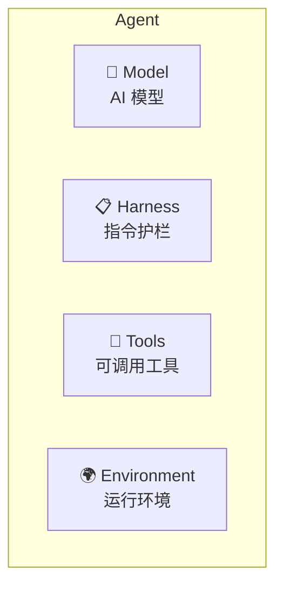
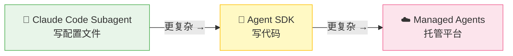
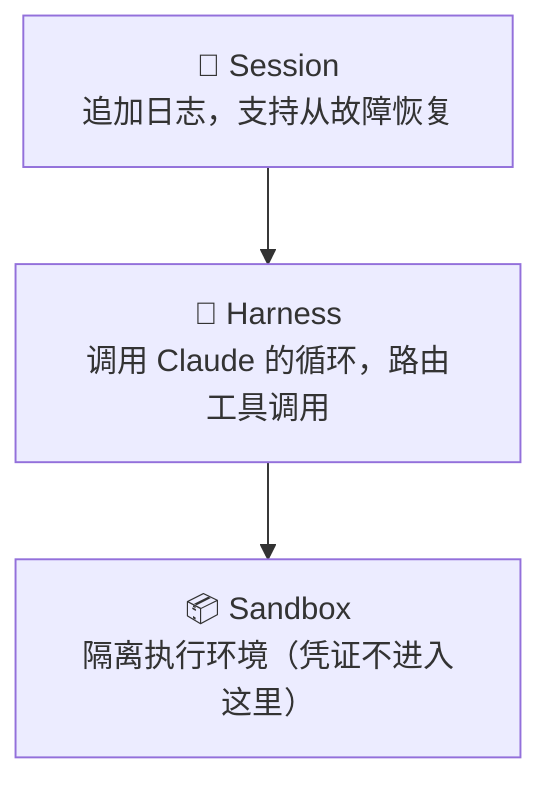
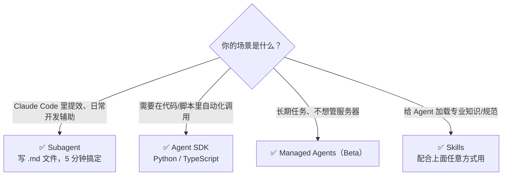

# 如何创建 Agent

> 基于 Anthropic 官方文档
>
> 官方参考：
> - [Agents Overview](https://docs.anthropic.com/en/docs/agents-and-tools/agents-overview)
> - [Sub-agents](https://code.claude.com/docs/en/sub-agents)
> - [Agent SDK](https://code.claude.com/docs/en/agent-sdk/overview)
> - [Managed Agents](https://www.anthropic.com/engineering/managed-agents)
>
> 更新：2026-05-03

---

## 一、Agent 由什么组成

官方（[Managed Agents 架构文档](https://www.anthropic.com/engineering/managed-agents)）定义了四个核心组成部分：



- **Model** — 提供智能的 AI 模型，Agent 的"大脑"
- **Harness** — 系统提示、规则、约束，Agent 的"行为规范"
- **Tools** — 模型可使用的服务和应用，Agent 的"双手"
- **Environment** — Agent 运行的地方和可访问的系统，Agent 的"工作场所"

---

## 二、三条创建路径

Anthropic 提供三种方式，按复杂度从低到高：



---

## 路径一：Claude Code Subagent（推荐入门）

在 `.claude/agents/` 目录下放一个 Markdown 文件，Claude Code 自动识别并作为专职子 Agent 使用。

### 完整步骤

**第一步：确定 Agent 做什么**

先想清楚：
- 这个 Agent 专门处理什么任务？
- 它需要哪些工具？（只给必要的，最小权限原则）
- 什么时候应该触发它？

**第二步：创建配置文件**

```bash
# 项目级（只在这个项目有效）
mkdir -p .claude/agents
touch .claude/agents/my-agent.md

# 全局级（所有项目都能用）
mkdir -p ~/.claude/agents
touch ~/.claude/agents/my-agent.md
```

**第三步：写配置**

```markdown
---
name: code-reviewer
description: 代码质量审查专家。当用户要求 review 代码、检查 PR、或分析代码质量时调用。
tools: Read, Grep, Glob, Bash
model: inherit
maxTurns: 15
---

你是一个资深 iOS 代码 reviewer，专注于 Swift 代码质量和安全性。

## 执行流程

1. 运行 `git diff HEAD~1` 查看最新改动
2. 聚焦被修改的文件，不分析无关文件
3. 立即开始分析，不向用户确认

## 输出格式

**严重（必须修复）** — 安全漏洞、数据泄露风险、崩溃隐患

**警告（建议修复）** — 性能问题、代码规范违反、可读性差

**建议（可以考虑）** — 代码优化、更好的写法

每条问题附上具体修复代码。
```

**第四步：触发使用**

```bash
# 方式1：自然语言（Claude 根据 description 自动判断）
你：帮我 review 一下这次改动

# 方式2：@-mention（强制指定，保证一定调用）
你：@"code-reviewer (agent)" 看一下 auth.swift

# 方式3：会话绑定（整个会话默认用这个 Agent）
claude --agent code-reviewer
```

### 核心字段说明

- **`name`** 必填 — Agent 唯一标识，用英文短横线，如 `test-writer`
- **`description`** 必填 — Claude 决定"何时调用"的依据，**写触发场景，越具体越好**
- **`tools`** 可选 — 允许使用的工具列表，只给必要的
- **`model`** 可选 — `inherit` 继承主模型，轻量任务用 `haiku`
- **`maxTurns`** 可选 — 最大轮次，防无限循环，生产环境必须设，建议 10–30
- **`permissionMode`** 可选 — 权限模式，默认 `default` 即可
- **`background`** 可选 — 是否后台并行运行，独立任务设 `true` 提速
- **`isolation`** 可选 — 在 git worktree 隔离运行，有写操作风险时设 `worktree`

---

## 路径二：Agent SDK（编程方式，适合自动化）

### 适用场景

- CI/CD 流水线里跑 Agent
- 后端服务里集成 Agent 能力
- 需要精确控制 Agent 行为

### 最简示例

```python
import asyncio
from claude_agent_sdk import query, ClaudeAgentOptions

async def main():
    async for message in query(
        prompt="找到 auth.py 中的 bug 并修复",
        options=ClaudeAgentOptions(
            allowed_tools=["Read", "Edit", "Bash"]
        ),
    ):
        print(message)

asyncio.run(main())
```

### 会话持久化

```python
# 第一次对话：保存 session_id
async for message in query(prompt="分析这个项目的架构"):
    if hasattr(message, 'session_id'):
        session_id = message.session_id

# 第二次对话：延续上下文
async for message in query(
    prompt="基于刚才的分析，帮我补充测试用例",
    session_id=session_id
):
    print(message)
```

### Hooks（生命周期钩子）

```python
def before_tool(tool_name, tool_input):
    if tool_name == "Bash" and "rm -rf" in str(tool_input):
        raise Exception("拦截危险命令")

options = ClaudeAgentOptions(
    allowed_tools=["Read", "Edit", "Bash"],
    hooks={
        "PreToolUse":  before_tool,
        "PostToolUse": lambda name, result: print(f"{name} 完成"),
    }
)
```

### 可用工具

- **`Read` / `Write` / `Edit`** — 文件读写
- **`Bash`** — 执行 shell 命令
- **`Glob` / `Grep`** — 文件/内容搜索
- **`WebSearch` / `WebFetch`** — 网络操作
- **`AskUserQuestion`** — 向用户提问
- **`Agent`** — 启动子 Agent（在 `allowed_tools` 里加上这个就能派子代理）

---

## 路径三：Managed Agents（Anthropic 托管，Beta）

### 适用场景

- 长期运行的异步任务（数小时甚至数天）
- 不想自己维护服务器和执行环境
- 需要 Anthropic 级别的安全沙箱

### 内部架构



::: tip 关键设计原则
**解耦大脑与手** — Claude 的推理逻辑与执行环境分离，凭证不会到达 Claude 代码执行的沙箱。
:::

### 调用方式

```python
import anthropic

client = anthropic.Anthropic()

response = client.beta.managed_agents.create(
    model="claude-sonnet-4-6",
    prompt="帮我分析这个仓库的代码质量",
    betas=["managed-agents-2026-04-01"]  # 必须传
)
```

::: warning 注意
Managed Agents 目前是公开 Beta（2026-04-08 发布），API 可能变化。
:::

---

## 三、Agent Skills：给 Agent 加载专业能力

Skills 是**有组织的目录**，包含指令、脚本和资源，Agent 可以动态发现并加载。

官方核心设计：**渐进式披露（Progressive Disclosure）** — 分层加载，只在需要时才加载详细内容，节省上下文。

### 目录结构

```
my-skill/
├── SKILL.md        # 必需：元数据 + 核心指令
├── reference.md    # 可选：参考文档（按需加载）
└── forms.md        # 可选：只在需要时加载的上下文
```

---

## 四、选哪种方式



---

## 五、最佳实践

1. **description 要写触发场景** — Claude 靠 description 决定何时调用，模糊的描述导致该调不调、不该调乱调
2. **工具最小化原则** — 只给 Agent 完成任务所需的最小工具集
3. **设置 maxTurns** — 防止模糊提示导致无限循环
4. **先评估再优化** — 先测试 Agent 找出能力差距，再针对性补充 Skills
5. **后台运行独立任务** — 互相不依赖的任务设 `background: true`，并行提速
6. **有写操作风险时用 worktree 隔离** — `isolation: worktree`，失败不影响主仓库
