# 多 Agent 协调：完整指南

> 基于 Anthropic 官方文档
>
> 官方参考：
> - [Building Effective Agents](https://www.anthropic.com/research/building-effective-agents)
> - [Sub-agents](https://code.claude.com/docs/en/sub-agents)
> - [Agent Teams](https://code.claude.com/docs/en/agent-teams)
> - [Agent SDK](https://code.claude.com/docs/en/agent-sdk/overview)
> - [Multi-Agent Research System](https://www.anthropic.com/engineering/multi-agent-research-system)
>
> 更新：2026-05-03

---

## 一、为什么需要多 Agent

官方研究数据（[Multi-Agent Research System](https://www.anthropic.com/engineering/multi-agent-research-system)）：

> 多 Agent 系统比单 Agent 方式在研究任务上性能提升 **90.2%**，代价是使用约 **15 倍**的 token。

**官方原则：只在更简单的方案明确不够用时，才引入多 Agent 复杂度。**

**适合场景：**
- 任务可以拆成互相独立的子任务并行完成
- 不同部分需要专业化处理（前端/后端/测试分别由专家处理）
- 需要互相 review 和验证（一个写，另一个审）
- 任务规模超过单个 Agent 的上下文窗口

**不适合场景：**
- 步骤严格串行、有强依赖
- 简单问答或一次性小任务
- 预算有限（多 Agent 成本线性增长）

---

## 二、三种 Agent 的本质区别

### 普通 Agent（单体）

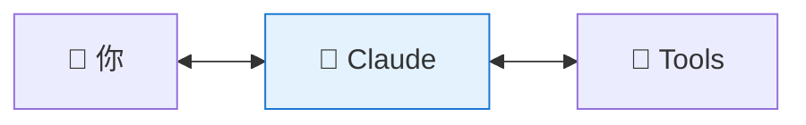

一个 Claude，自己做完所有事。

### Subagent（专职工作者）

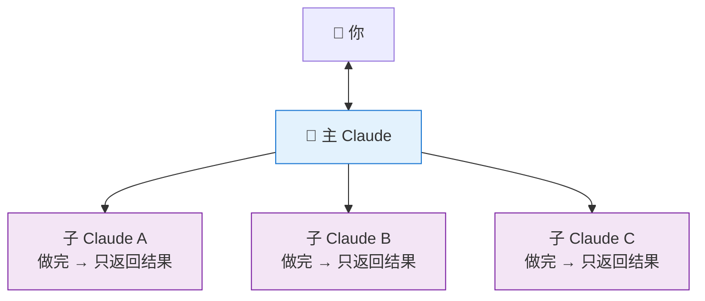

主 Claude 派专职 Claude 干活，子 Claude 只向主 Claude 汇报。

### Agent Team（协作团队）

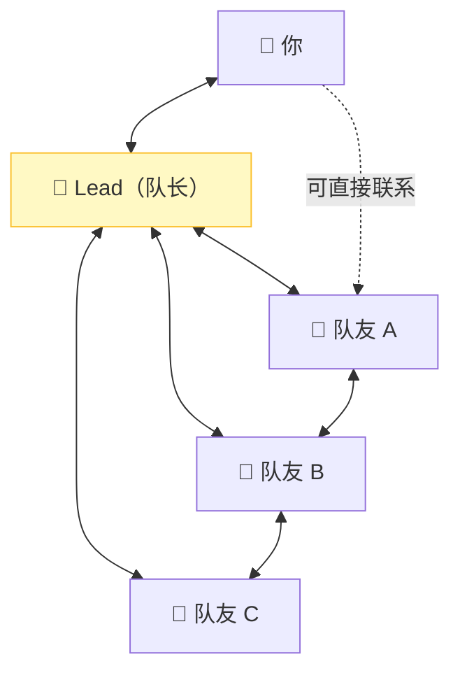

每个队友独立运行，可以直接互发消息，你也能直接跟某个队友说话。

### 三种模式对比

**普通 Agent**
- 上下文：单一共享上下文
- 通信：你和它直接对话
- 协调：自己决定所有步骤
- 成本：最低
- 适合：单一连贯任务

**Subagent**
- 上下文：独立上下文，只把结果返回给主 Agent
- 通信：子 Agent 只向主 Agent 单向汇报
- 协调：主 Agent 管理所有工作分配
- 成本：中等
- 适合：有侧任务会污染主上下文；反复用同类工作者

**Agent Team**
- 上下文：每个队友独立上下文，完全隔离
- 通信：队友之间可直接互发消息，你也能直接联系某个队友
- 协调：共享任务列表 + 自主认领 + Lead 综合
- 成本：最高
- 适合：需要讨论、互相挑战、协作的复杂工作

---

## 三、普通 Agent：基础单体

普通 Agent 就是你平时用的 Claude Code，有工具、会循环推进任务直到完成。

**适合：** 单一连贯任务、上下文不超窗口限制、没有需要专业化处理的子任务

---

## 四、Subagent：专职工作者

### 官方定义

> Use one when **a side task would flood your main conversation** with search results, logs, or file contents you won't reference again.

两个使用时机：
1. **侧任务会污染主上下文**：比如搜索 100 个文件，结果不需要留在主对话里
2. **反复需要同类工作者**：比如每次都要"审查代码"，固化成 Subagent

### 上下文隔离机制

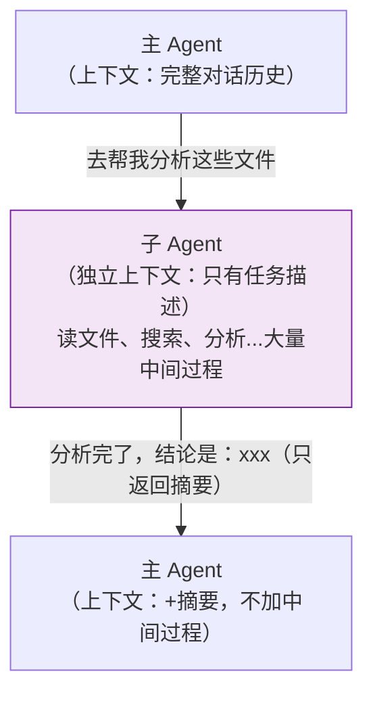

**关键：** 子 Agent 执行过程中产生的大量内容不会进入主 Agent 的上下文，这是保护主上下文的核心机制。

### 创建 Subagent

**`.claude/agents/swift-analyzer.md`**

```markdown
---
name: swift-analyzer
description: |
  Swift 代码质量分析师。
  当需要分析 Swift 代码结构、找潜在问题、输出质量报告时调用。
  不负责修改代码，只负责分析和报告。
tools: Read, Grep, Glob
model: haiku
maxTurns: 20
---

你是一个 Swift 代码质量分析师。

## 分析维度

1. **安全问题**：force unwrap、未处理的错误、硬编码敏感信息
2. **规范问题**：命名规范、函数长度（超 80 行标记）
3. **架构问题**：循环依赖、单一职责违反

## 输出格式

### 严重问题（[文件名:行号] 问题描述）
### 警告
### 建议

每条问题附上修复示例代码。
```

### 前台 vs 后台

- **前台（默认）** — 主 Agent 等子 Agent 完成才继续，适合子 Agent 的结果是主 Agent 下一步输入的情况
- **后台（`background: true`）** — 主 Agent 继续响应你，子 Agent 并发执行，适合完全独立、不影响主流程的任务

---

## 五、Agent Team：协作团队

### 官方定义

> Agent teams let you coordinate **multiple Claude Code instances working together**. Teammates work independently, each in its own context window, and **communicate directly with each other**.
>
> Unlike subagents, **you can also interact with individual teammates directly** without going through the lead.

### 四个组成部分

**Team Lead（队长）**
- 职责：创建团队、分配任务、监控进度、综合结果
- 特点：就是你当前的主 Claude Code 会话，拥有最完整的上下文

**Teammates（队友）**
- 职责：领取任务、独立执行、通信协作、标记完成
- 特点：每个队友是独立的 Claude Code 实例，有独立上下文；加载项目的 CLAUDE.md 和 MCP，但**不继承 Lead 的对话历史**；给队友的任务描述**必须自包含**

**Task List（共享任务列表）**

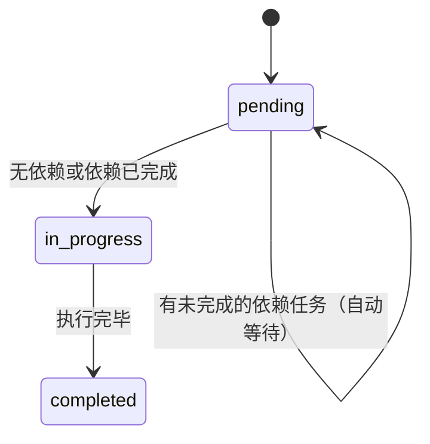

任务认领方式：
- **Lead 显式分配**：告诉 Lead 把哪个任务给哪个队友
- **队友自主认领**：完成当前任务后，自动认领下一个可用任务

**Mailbox（消息系统）**

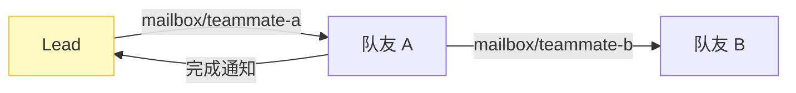

### Subagent vs Agent Team 通信差异

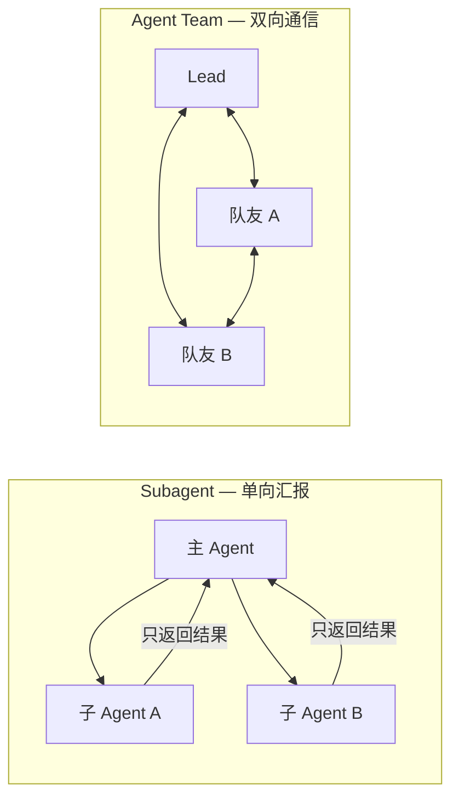

### 两种显示模式

- **In-process 模式**（默认）：所有队友在主终端同一界面，用 `Shift+Down` 切换
- **Split panes 模式**（需要 tmux 或 iTerm2）：每个队友独占一个窗格，可同时看到所有队友实时进度

---

## 六、五种核心协调模式

来自官方 [Building Effective Agents](https://www.anthropic.com/research/building-effective-agents)

### 模式 1：Orchestrator-Workers（最常用）⭐

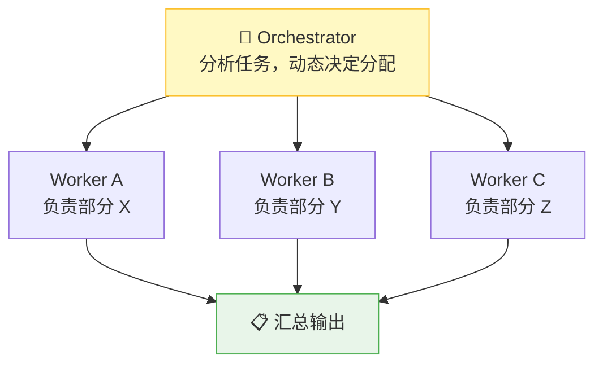

Orchestrator 不执行具体工作，只负责分解和协调。**适合：** 功能开发、代码重构、分析大型代码库

### 模式 2：Parallelization（并行）

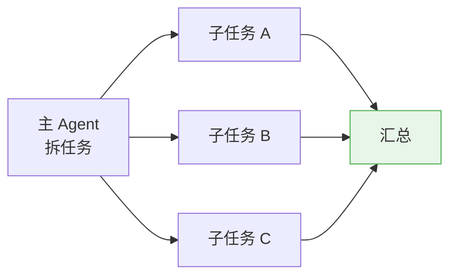

> 官方数据：子 Agent 内部同时使用 3+ 个工具并行，可减少 **90%** 执行时间。

**适合：** 分析多个不相关文件、搜索多个数据源

### 模式 3：Prompt Chaining（链式）

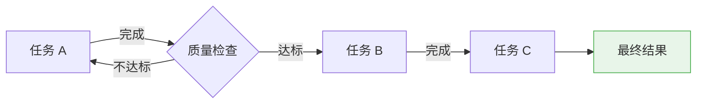

**适合：** 架构分析 → 实现 → 测试（有严格顺序依赖）

### 模式 4：Routing（路由）

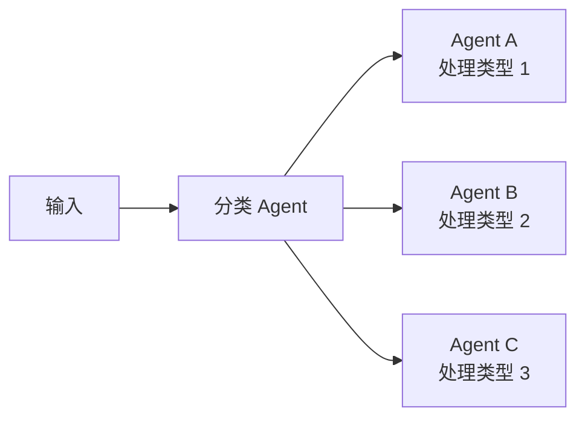

**适合：** 不同类型的 bug 用不同专家处理，不同语言用不同代码生成器

### 模式 5：Evaluator-Optimizer（评估 + 优化循环）

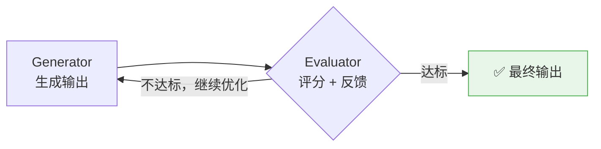

**适合：** 代码质量要求高、需要多轮迭代改进的场景

---

## 七、实战：iOS 设备分组功能开发

**任务：** 给 Wyze 插件新增"设备分组"功能，包含架构分析、代码实现、单测编写、代码审查四个环节。

### 任务依赖关系

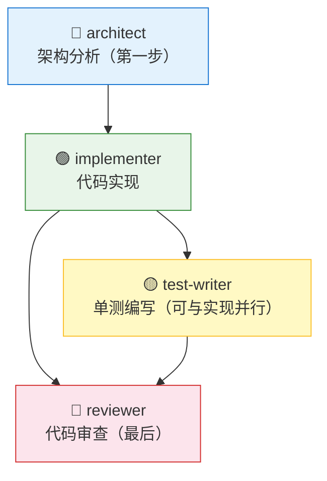

### 四个专职 Subagent 配置

**`.claude/agents/architect.md`**

```markdown
---
name: architect
description: |
  iOS 架构分析师。
  当任务需要分析现有模块结构、设计新功能的接口和文件结构时调用。
  输出实现方案，不写实现代码。
tools: Read, Grep, Glob
model: sonnet
maxTurns: 25
color: blue
---

你是一个 iOS 架构分析师，专注于 Swift 项目的模块结构设计。

## 分析流程

1. 用 Glob 扫描项目目录，了解整体结构
2. 用 Grep 查找与任务相关的现有代码
3. 读取关键文件，理解现有模式
4. 检查 wyze-wpk-* 系列是否有可复用组件（优先复用）

## 输出格式

### 新增文件
| 文件路径 | 职责 |

### 修改文件
| 文件路径 | 修改内容 |

### 核心接口定义
[Protocol 定义]

### 数据流
[ViewController → ViewModel → Repository → Network 的数据流向]
```

**`.claude/agents/implementer.md`**

```markdown
---
name: implementer
description: |
  iOS Swift 功能实现者。
  当有明确的架构方案，需要编写 Swift 实现代码时调用。
tools: Read, Write, Edit, Bash
model: sonnet
maxTurns: 40
color: green
---

你是一个 iOS Swift 开发工程师，专注于按架构方案编写高质量代码。

## 编码规范

- 类名用 WZ 前缀（WZDeviceGroup, WZDeviceGroupViewModel）
- 错误处理：底层用 `throws`，上层包装为 `Result<T, Error>` 传给 UI
- 函数超 80 行必须拆分
- 禁止 force unwrap（`!`）
```

**`.claude/agents/test-writer.md`**

```markdown
---
name: test-writer
description: |
  iOS 单测编写者。
  当 Swift 功能代码编写完成，需要编写 XCTest 单元测试时调用。
tools: Read, Write, Edit, Glob
model: haiku
maxTurns: 25
color: yellow
---

命名规范：`test_<被测方法>_<场景>_<期望结果>`

覆盖三条路径：正常路径、边界条件、错误路径
```

**`.claude/agents/reviewer.md`**

```markdown
---
name: reviewer
description: |
  iOS 代码审查者。
  当功能代码和测试都完成，需要做最终代码 review 时调用。
tools: Read, Grep, Glob, Bash
model: sonnet
maxTurns: 20
color: red
---

## 审查清单

**严重（必须修复）**
- force unwrap（`!`）
- 硬编码的 key/url/password
- 未处理的错误路径
- 内存泄漏风险（循环引用，闭包未捕获 weak self）

**警告（应该修复）**
- 不符合 WZ 前缀规范
- 函数超过 80 行
- 魔法数字或魔法字符串
```

### 执行时间线

```mermaid
gantt
    dateFormat mm
    axisFormat %M min
    section 执行流程
    architect（架构分析）    :a1, 00, 20m
    implementer（代码实现）  :a2, after a1, 50m
    test-writer（单测编写）  :a3, after a1, 50m
    reviewer（代码审查）     :a4, after a2, 20m
```

### 过程中如何监控

```bash
# 直接联系某个队友（不经过 Lead）
@"implementer (agent)" 进度怎么样了？

# 给卡住的队友提示
@"test-writer (agent)" DeviceGroupViewModel 的异步方法用 async/await 测试

# 让 Lead 汇总当前状态
"所有队友现在进展如何？"

# 发现队友跑偏，直接重定向
@"architect (agent)" 不需要新建网络层，直接用 WZNetworkService
```

---

## 八、Subagent 完整字段说明

- **`name`** 必填 — 唯一标识，小写字母+短横线，如 `swift-analyzer`
- **`description`** 必填 — Claude 据此决定何时调用，**写具体触发场景，最重要的字段**
- **`tools`** 可选 — 允许的工具列表，不填则继承全部，只给必要工具
- **`disallowedTools`** 可选 — 强制禁用的工具，确保只读 Agent 不能写文件
- **`model`** 可选 — 默认 `inherit`，轻量任务用 `haiku`，复杂推理用 `sonnet`
- **`permissionMode`** 可选 — `default` / `acceptEdits` / `auto` / `bypassPermissions`，一般保持 `default`
- **`maxTurns`** 可选 — 最大执行轮次，**生产环境必填**，建议 15–30
- **`skills`** 可选 — 预加载的 Skills，Subagent 不继承父会话的 Skills，需手动指定
- **`mcpServers`** 可选 — 可用的 MCP 服务器
- **`hooks`** 可选 — 生命周期钩子（PreToolUse / PostToolUse / Stop），用于日志、拦截危险操作
- **`memory`** 可选 — 持久记忆范围：`user` / `project` / `local`
- **`background`** 可选 — `true` 表示始终后台运行，独立任务不阻塞主对话
- **`effort`** 可选 — 覆盖 effort 级别：`low` / `medium` / `high` / `xhigh` / `max`
- **`isolation`** 可选 — `worktree`，在隔离的 git worktree 里运行，有写操作风险时使用
- **`color`** 可选 — 显示颜色（`red` / `blue` / `green` 等 8 色），多个 Agent 运行时便于区分
- **`initialPrompt`** 可选 — 用 `--agent` 启动时自动发送的第一条消息

---

## 九、最佳实践

- **团队规模** — 从 3–5 个队友开始，每增加一个队友 token 成本线性增长
- **任务粒度** — 每个队友分配 5–6 个任务最优，任务应该是"能产出清晰交付物的自包含单元"
- **上下文传递** — 队友不加载 Lead 的对话历史，给队友的任务描述必须自包含
- **文件冲突** — 每个队友应该拥有不同的文件集合，避免同时写同一个文件
- **启动顺序** — 先从"只读、边界清晰"的研究/review 任务开始，不要上来就让多个 Agent 同时写代码

---

## 十、已知限制

- **无法恢复 in-process 队友** — `/resume` 和 `/rewind` 不会恢复 in-process 模式的队友
- **任务状态可能滞后** — 队友有时忘记标记任务完成，会阻塞有依赖关系的后续任务
- **关闭较慢** — 队友会等当前请求完成才关闭
- **每个 Session 只能有一个团队** — Lead 一次只能管理一个团队
- **队友不能再建团队** — 不支持嵌套团队
- **Split panes 需要 tmux 或 iTerm2** — 默认 in-process 模式无此限制

---

## 十一、选择指南

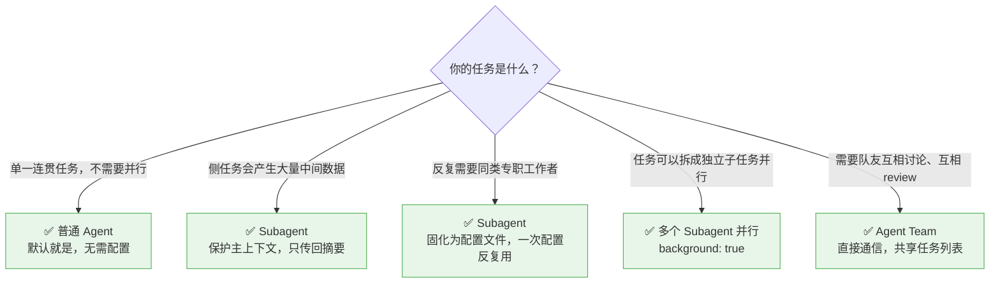

> 成本参考：普通 Agent < Subagent < 多 Subagent < Agent Team

---

::: warning 官方的忠告
> Only add agentic complexity when simpler solutions demonstrably fail.
> Single optimized LLM calls often suffice.

**只有更简单的方案明确不够用时，才引入多 Agent 复杂度。一个调优好的单次调用往往就够了。**
:::
