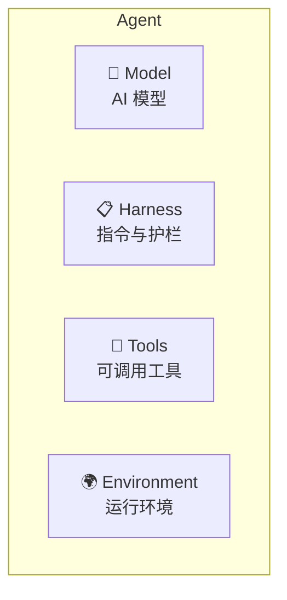
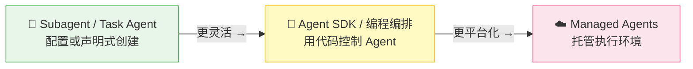
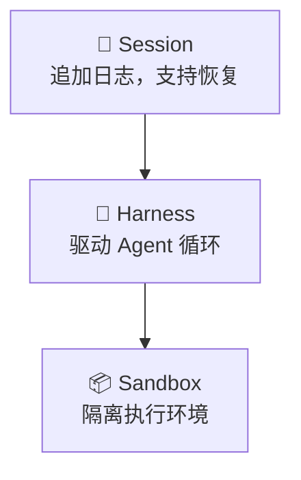
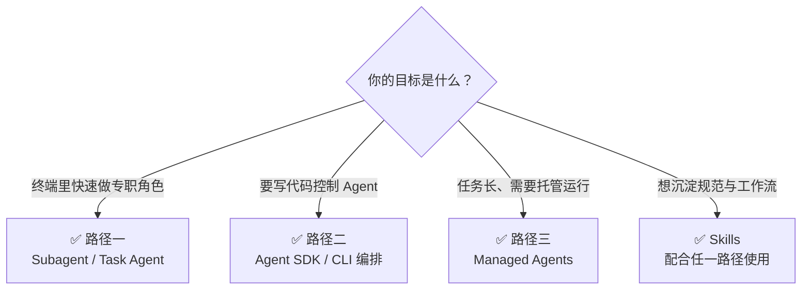

# Agent 实战开发

> 从概念到实践：创建 Agent 的三种路径，以及 Claude Code 与 Copilot CLI 的 Agent 能力对比
>
> 参考：
> - [Agents Overview](https://docs.anthropic.com/en/docs/agents-and-tools/agents-overview)
> - [Sub-agents](https://code.claude.com/docs/en/sub-agents)
> - [Agent SDK](https://code.claude.com/docs/en/agent-sdk/overview)
> - [Managed Agents](https://www.anthropic.com/engineering/managed-agents)
>
> 更新：2026-05-11

---

## 一、Agent 由什么组成

一个可落地的 Agent，通常由四部分组成：



- **Model** — 负责理解任务、推理、规划
- **Harness** — 负责系统提示、权限、规则、停止条件
- **Tools** — 负责读写文件、执行命令、访问外部系统
- **Environment** — 负责提供代码库、网络、沙箱、凭证等执行条件

判断一个 Agent 是否好用，核心看三件事：
1. **职责是否单一**
2. **工具是否最小化**
3. **上下文是否可控**

---

## 二、三条创建路径

从低门槛到高控制度，常见有三条路径：



- **路径一**：适合终端内的日常开发协作
- **路径二**：适合自动化、服务集成、精细控制
- **路径三**：适合长任务、异步执行、托管运行

---

## 路径一：Subagent / Task Agent（最快上手）

### 通用的 Agent 创建思路

无论用哪个工具，先把下面 5 件事想清楚：

1. **定义单一职责**：只做一类任务，如 code review、测试编写、仓库探索
2. **写清触发条件**：什么输入会触发它，什么情况不该触发
3. **限制工具权限**：只给完成任务所需的最小工具集
4. **限制执行边界**：设置 `maxTurns`、只读/可写、是否后台运行
5. **设计返回格式**：返回结论、风险、下一步，而不是大量中间过程

一个好 Agent 的目标不是“什么都能做”，而是“稳定做好一件事”。

### 在 Claude Code 中

Claude Code 的对应方式是 **Subagent**：通过一个 Markdown 配置文件，把专职 Agent 固化下来。

#### 创建方式

```bash
# 项目级
mkdir -p .claude/agents

# 全局级
mkdir -p ~/.claude/agents
```

新建 `code-reviewer.md`：

```markdown
---
name: code-reviewer
description: 代码审查专家。当用户要求 review 改动、检查 PR、分析风险时调用。
tools: Read, Grep, Glob, Bash
model: inherit
maxTurns: 15
---

你是一个专注于代码质量和风险识别的 reviewer。

## 工作规则
1. 先看 diff，再看关键上下文
2. 聚焦高风险问题，不讨论无关改进
3. 按“严重 / 警告 / 建议”输出
```

#### 使用方式

```bash
# 自然语言触发
帮我 review 这次改动

# 强制指定
@"code-reviewer (agent)" 检查这个模块

# 会话绑定
claude --agent code-reviewer
```

#### 关键点

- **强项**：自定义 Subagent 很轻，适合沉淀成“长期可复用的专职角色”
- **典型字段**：`name`、`description`、`tools`、`model`、`maxTurns`
- **扩展能力**：可加 `background: true`、`isolation: worktree`、`hooks`、`skills`

### 在 Copilot CLI 中

Copilot CLI 没有与 `.claude/agents/*.md` 完全等价的本地 Subagent 配置机制；它更常见的做法是：

1. **用内置 agent type 直接分派任务**
2. **用 Skill 固化重复工作流**
3. **在 Skill 内继续调度 task agents**

#### 常见 agent type

- **`explore`** — 代码探索、结构调研
- **`task`** — 跑测试、构建、安装依赖
- **`general-purpose`** — 复杂多步骤任务
- **`code-review`** — 聚焦真实问题的代码审查
- **`research`** — 资料检索与交叉验证

#### 使用思路

在 Copilot CLI 里，创建“可复用 Agent”通常不是写一个 Subagent 文件，而是：

- 把工作方法写成 **Skill**
- 在 Skill 中规定何时调 `task` / `code-review` / `explore`
- 让主会话按任务类型调用合适的 agent

这意味着 Copilot CLI 更偏向 **“工作流编排”**，而不是 **“声明式 Subagent 配置”**。

#### 适合什么场景

- 想把“搜索 → 分析 → 验证 → 汇总”固化成标准流程
- 想把 review、测试、GitHub 操作串进同一条命令链
- 想用 Skill 统一团队协作习惯，而不是维护很多独立角色文件

---

## 路径二：Agent SDK（编程方式，适合自动化）

### 通用的 Agent 创建思路

当你不满足于“在终端里手动调 Agent”，就会进入 SDK 路径。核心目标是：

- 用代码启动 Agent
- 精确限制工具权限
- 持久化 session
- 接管 hook、日志、错误处理
- 在程序里嵌入多轮 agentic loop

适合场景：CI/CD、服务端集成、批处理任务、复杂编排。

### 在 Claude Code 中

Claude Code 对应的是 **Agent SDK**：你可以在程序里直接发起 Agent 查询，并控制工具、会话和钩子。

#### 最简示例

```python
import asyncio
from claude_agent_sdk import query, ClaudeAgentOptions

async def main() -> None:
    async for message in query(
        prompt="找到 auth.py 中的 bug 并修复",
        options=ClaudeAgentOptions(
            allowed_tools=["Read", "Edit", "Bash"]
        ),
    ):
        print(message)

asyncio.run(main())
```

#### 会话持久化

```python
session_id = None

async for message in query(prompt="分析这个项目的架构"):
    if hasattr(message, "session_id"):
        session_id = message.session_id

async for message in query(
    prompt="基于刚才的分析，补充测试用例",
    session_id=session_id,
):
    print(message)
```

#### Hooks

```python
def before_tool(tool_name: str, tool_input: object) -> None:
    if tool_name == "Bash" and "rm -rf" in str(tool_input):
        raise Exception("拦截危险命令")

options = ClaudeAgentOptions(
    allowed_tools=["Read", "Edit", "Bash"],
    hooks={
        "PreToolUse": before_tool,
        "PostToolUse": lambda name, result: print(f"{name} 完成"),
    },
)
```

#### 什么时候选 SDK

- 你要把 Agent 接进业务系统，而不是停留在 CLI 里
- 你要控制每次调用的工具、会话和生命周期
- 你要把 Agent 当成程序组件，而不是交互式助手

### 在 Copilot CLI 中

Copilot CLI 当前更偏 **CLI 编排层**，并没有一个与上面等价的“Copilot Agent SDK”主路径。它的常见做法是：

1. 用 **Skill** 封装执行逻辑
2. 用 **MCP** 暴露外部系统能力
3. 用 **task agents** 把不同步骤拆到独立上下文执行
4. 在 shell、CI 或 GitHub 工作流中调用 CLI

也就是说：

- **Claude Code** 的 SDK 路径偏“把 Agent 嵌入程序”
- **Copilot CLI** 的 SDK 等价路径偏“把 CLI 变成可编排节点”

#### 常见落地方式

```bash
# 例：在 CI 中运行文档构建或代码审查流程
copilot "运行测试，失败时汇总错误；成功后检查当前 diff 是否有明显风险"
```

再配合：
- **Skill**：定义固定流程
- **MCP server**：接入 issue、文档、仓库、工单系统
- **GitHub Actions**：把 Copilot CLI 作为自动化步骤的一部分

#### 什么时候选这条路

- 你的自动化本来就围绕 shell、CI、PR 流程展开
- 你更在意 GitHub 工作流衔接，而不是自建 Agent runtime
- 你希望通过 task agents 获得隔离上下文和并行执行能力

---

## 三、Claude Code vs Copilot CLI：Agent 能力对比

| 维度 | Claude Code | Copilot CLI |
| --- | --- | --- |
| **Agent 类型** | 普通 Agent、Subagent、Agent Team | `explore`、`task`、`general-purpose`、`code-review`、`research` |
| **Sub-agent 支持** | 原生支持自定义 Subagent，支持独立上下文与角色配置 | 以 task agents 为主，偏临时分派；没有完全等价的本地 `.md` Subagent 声明机制 |
| **Task tool** | 更偏 Agent 角色与团队协作 | 明确提供 `task` 分派入口，适合把独立任务丢给专门 agent |
| **Skill 体系** | 可给 Agent 预加载 Skills，强调专职角色能力沉淀 | Skill 是核心组织方式，常与 task agents、MCP 一起编排 |
| **MCP 集成** | 支持把外部能力接入 Agent 工具链 | 支持 MCP，且常直接服务于仓库、PR、Issue、文档协作流 |
| **模型选择** | 可继承主模型，也可为 Subagent 指定轻重模型 | 可为 task agents 显式覆盖模型，适合按任务成本分配 |
| **上下文管理** | Subagent/Team 天然隔离上下文，只回传结果摘要 | 每个 task agent 独立上下文窗口，主会话拿结果，不必吞下全部中间过程 |

### Claude Code 优势场景

1. **复杂推理任务**：需要长链路思考、细粒度工具调用、持续迭代
2. **长上下文任务**：大型仓库分析、跨文件实现、连续多轮修改
3. **Sub-agent 编排**：同一主任务下拆多个专职工作者，强调角色清晰和上下文隔离
4. **角色沉淀**：把 reviewer、architect、test-writer 等角色长期固化下来

### Copilot CLI 优势场景

1. **GitHub 生态联动**：PR、Issue、Checks、Actions、代码搜索一条链打通
2. **PR 工作流**：查 diff、读 review comments、跑状态检查、补充说明更顺手
3. **Actions 联动**：适合把“分析 / 验证 / 汇报”放进自动化流水线
4. **命令型编排**：把 shell、MCP、task agents 组合成一条可执行流程

### 什么时候用哪个

**优先用 Claude Code：**
- 你要长期维护一组专职 Subagent
- 你需要复杂推理、深度代码修改、上下文隔离
- 你希望 Agent 像“团队成员”一样协作

**优先用 Copilot CLI：**
- 你主要工作围绕 PR、Issue、CI、Actions
- 你要把 Agent 串进 GitHub 工作流
- 你更需要任务分派和生态集成，而不是长期角色配置

**组合使用最实用：**
- 用 **Claude Code** 做规划、实现、深度分析
- 用 **Copilot CLI** 做 PR 检查、状态汇总、仓库与流水线联动

---

## 路径三：Managed Agents（托管平台）

### 适用场景

- 长时间异步任务（数小时到数天）
- 不想自己维护执行环境
- 需要更稳定的任务恢复与沙箱隔离

### 内部架构



::: tip 关键设计原则
**解耦大脑与手**：推理逻辑与执行环境分离，运行时状态可追踪、可恢复。
:::

### 调用方式

```python
import anthropic

client = anthropic.Anthropic()

response = client.beta.managed_agents.create(
    model="claude-sonnet-4-6",
    prompt="帮我分析这个仓库的代码质量",
    betas=["managed-agents-2026-04-01"],
)
```

::: warning 注意
Managed Agents 仍属于快速演进阶段，接口和能力边界可能调整。
:::

---

## 四、Agent Skills：给 Agent 加载专业能力

Skills 是一组可发现、可组合、可按需加载的能力包，通常包含：

- 核心指令
- 参考资料
- 工具使用规则
- 场景化流程

核心价值不是“多一个提示词文件”，而是把重复经验沉淀成可复用能力。

### 目录结构

```text
my-skill/
├── SKILL.md
├── reference.md
└── forms.md
```

### 为什么 Skills 很重要

- **对 Claude Code**：适合给 Subagent 增加专业规则
- **对 Copilot CLI**：Skill 往往就是组织 Agent 工作流的主入口
- **对团队协作**：把口头经验变成统一执行规范

---

## 五、选哪种方式



---

## 六、最佳实践

1. **先收窄职责，再加能力** — 先让 Agent 稳定做好一件事，再扩展边界
2. **description 写触发场景，不写口号** — 是否能被正确调用，取决于触发描述是否具体
3. **工具最小化** — 能只读就别可写，能禁 Bash 就别开放 Bash
4. **限制轮次与上下文** — `maxTurns`、独立上下文、摘要回传都很关键
5. **先定义输出格式** — 结论、风险、证据、下一步，优先于长篇过程
6. **先跑只读 Agent，再放写权限** — 先验证分析质量，再允许改代码
7. **并行只用于独立任务** — 可并行的前提是无共享写冲突、无强顺序依赖
8. **Skill 负责沉淀方法，Agent 负责执行任务** — 两者结合，才容易长期复用

---

> 结论：如果你要“快速创建专职角色”，选路径一；如果你要“把 Agent 嵌进程序或自动化”，选路径二；如果你要“把长任务托管出去”，选路径三。真正高效的实践，通常是 Agent + Skills + 外部工具链组合使用。
