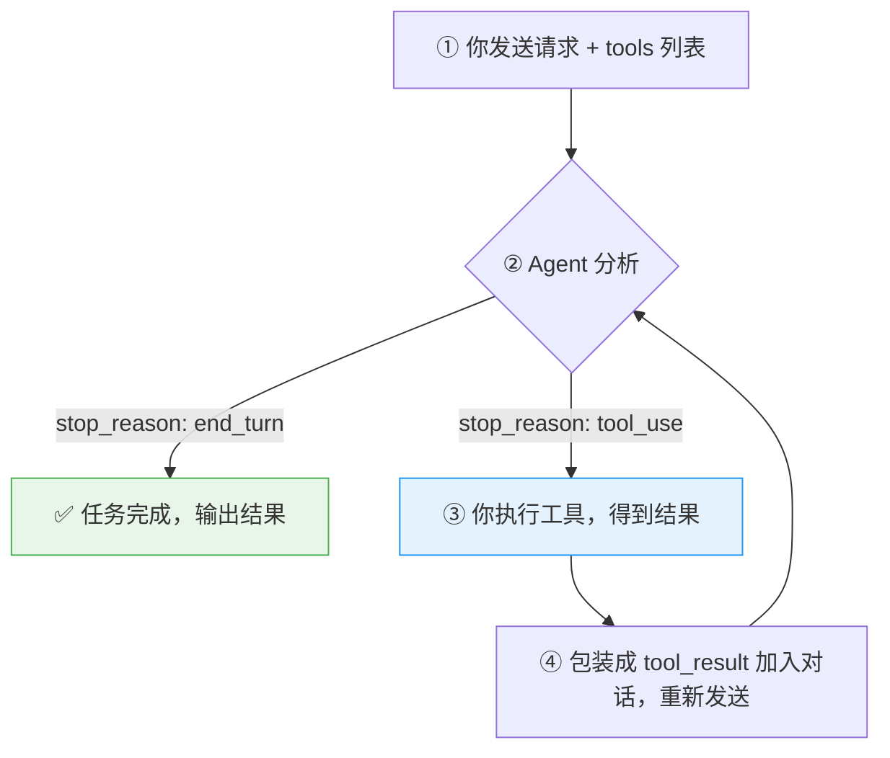
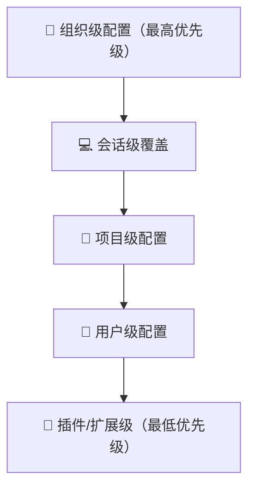
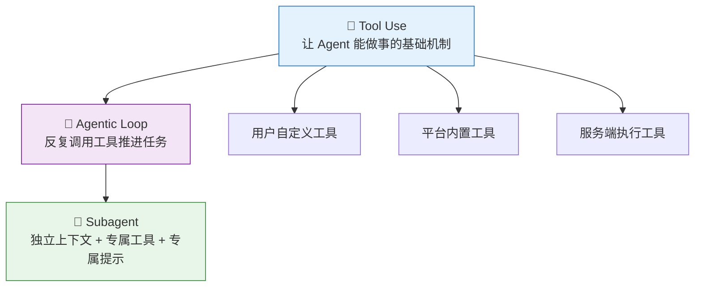

# Agent 概念与原理

> 理解 AI Agent 的核心概念、工作原理与工具调用机制
>
> 更新：2026-05-11

---

## 一、什么是 Agent

### 官方定义

> An AI agent is a system that uses a language model to **direct its own processes and tool usage** to accomplish a goal.
> — Anthropic 官方文档

关键词：**主动引导自身的执行过程**。Agent 不是被动回答，而是主动决策、调用工具、反复推进，直到完成目标。

### 和普通对话的区别

::: info 普通对话（无工具）
你：帮我看看 auth.swift 有没有问题

AI 助手：我无法直接读取文件，请把内容粘贴给我
:::

::: tip Agent（有工具）
你：帮我看看 auth.swift 有没有问题

AI Agent：
1. 调用 `Read` 工具读取文件
2. 发现第 42 行有个 force unwrap
3. 调用 `Grep` 搜索是否有其他地方有类似问题
4. 汇总完整的安全问题报告
:::

---

## 二、Tool Use：Agent 的行动能力

没有工具，大模型只能说话；有了工具，AI Agent 才能真正"做事"。

常见的 Agent 工具体系通常分为三类，区别在于**谁来执行**：

### 类型 1：用户自定义工具

你写工具的描述和参数格式，AI Agent 决定何时调用，你负责实际执行并返回结果。

**适合：** 调你自己的数据库、内部接口、业务逻辑。

```python
tools = [{
    "name": "get_device_status",
    "description": "查询指定设备的在线状态",
    "input_schema": {
        "type": "object",
        "properties": {
            "device_id": {"type": "string", "description": "设备 ID"}
        },
        "required": ["device_id"]
    }
}]
# AI Agent 分析后决定要调这个工具
# 你接到 tool_use 响应，自己去查数据库，把结果返回给模型
```

### 类型 2：平台内置工具

工具 schema 由平台预定义，模型通常针对这些工具做过额外训练，因此往往比同等功能的自定义工具更稳定。

以下名称采用 Anthropic 文档里的示例命名，不同平台会有等价能力：

- **`bash`** — 执行 shell 命令
- **`text_editor`** — 查看和编辑文件（view / str_replace / undo_edit）
- **`computer`** — 控制鼠标、键盘、截图
- **`memory`** — 保存和读取跨会话记忆

> 在很多 Agent 平台里，读文件、改代码、跑命令，本质都属于这类工具能力。

### 类型 3：服务端工具

由平台服务端执行，你只收到最终结果，看不到完整中间过程。

以下同样沿用 Anthropic 文档里的命名示例：

- **`web_search`** — 搜索网页
- **`web_fetch`** — 抓取网页内容
- **`code_execution`** — 在沙盒中运行代码
- **`tool_search`** — 从工具库中搜索合适的工具

::: warning 注意
服务端工具执行中可能返回 `stop_reason: "pause_turn"`，表示内部还没结束，你需要重新发送请求让它继续。
:::

### 什么时候用 Tool Use

**适合用：**
- 有副作用的操作（写文件、发消息、更新数据库）
- 需要实时数据（天气、价格、数据库记录）
- 需要强制结构化输出（特定 JSON 字段）
- 调用已有系统（内部 API、文件系统）

**不适合用：**
- 模型自身能回答的（总结、翻译、常识问题）
- 一次性问答，无副作用
- 工具调用延迟超过实际收益时

---

## 三、Agentic Loop：Agent 是怎么工作的

这是理解 Agent 最核心的部分。



### 代码示例（Python，最小可运行版）

下面用 Anthropic Messages API 展示标准 tool loop 的形态；即使换成别的平台，核心流程也基本类似。

```python
import anthropic

client = anthropic.Anthropic()

tools = [...]        # 你定义的工具列表
messages = [{"role": "user", "content": "帮我检查 main.swift 的代码质量"}]

while True:
    response = client.messages.create(
        model="claude-sonnet-4-6",
        max_tokens=1024,
        tools=tools,
        messages=messages
    )

    if response.stop_reason == "end_turn":
        print(response.content[0].text)
        break

    if response.stop_reason == "tool_use":
        tool_block = next(b for b in response.content if b.type == "tool_use")
        result = my_execute(tool_block.name, tool_block.input)

        messages.append({"role": "assistant", "content": response.content})
        messages.append({
            "role": "user",
            "content": [{
                "type": "tool_result",
                "tool_use_id": tool_block.id,
                "content": result
            }]
        })
```

::: tip 生产环境建议
给循环加 `maxTurns` 上限，防止因提示词模糊导致 Agent 无限循环消耗 token。
:::

---

## 四、Subagent：把任务拆给更小的 Agent

### 通用概念

Subagent 可以理解为**专门处理某一类任务的子 Agent**。它通常具备独立上下文、独立工具权限和更聚焦的系统提示，只负责一小块明确问题，再把结果返回给主 Agent。

关键点：**独立上下文窗口**。子 Agent 和主 Agent 一般不共享完整记忆，主 Agent 收到的通常只是结论、摘要或产出物。

### 为什么需要 Subagent

**1. 保护主上下文**
读大量文件时，交给子 Agent 处理，只把关键结论返回，主上下文不被撑满。

**2. 并行加速**
多个子 Agent 同时工作，互不等待。同时分析三个模块，通常比串行更快。

**3. 权限最小化**
只读任务用只读子 Agent，减少误操作风险。

### 前台 vs 后台运行

- **前台** — 阻塞主对话，适合需要实时确认的任务
- **后台** — 并发执行，适合独立的并行任务；主流程可以继续推进

### Claude Code 的实现方式

Claude Code 通过 **Task tool / Subagent** 实现这套能力，常见内置类型包括：

- **`Explore`** — 只读探索代码库、发现文件
- **`Plan`** — 只读分析规划
- **`General-purpose`** — 具备完整工具能力，适合复杂多步骤任务

它的核心特点是：**子 Agent 在自己的上下文里工作，完成后只把结果回传主会话**。

### Copilot CLI 的实现方式

Copilot CLI 也提供了相同思路的子 Agent 调度能力，典型入口有两层：

- **对话层**：`/fleet` 用于并行 Agent 执行，`/sidekicks` 或 `/tasks` 查看运行中的 Agent / 任务
- **工具层**：通过 `Task tool` 指定不同 `agent_type`，例如 `explore`、`task`、`general-purpose`、`code-review`、`research`

本质上，它和 Claude Code 一样，都是把复杂任务拆成更小、更专门、可并行的执行单元。

---

## 五、自定义 Subagent：把角色、工具和边界固化下来

### 通用概念

自定义 Subagent 的本质，是把一个常见任务模式写成可复用的执行角色。通常要明确四件事：

1. **它解决什么问题**
2. **它能用哪些工具**
3. **它不能做什么**
4. **什么情况下应该调它**

如果一个 Agent 经常重复做同一类事，比如代码审查、依赖分析、文档整理，那就适合抽成自定义 Subagent。

### 配置优先级（通用视角）



同名 Agent 通常以更高优先级的配置为准。

### 关键字段（通用抽象）

- **`name`** — 代理名称，便于显式调用
- **`description`** — 触发场景与职责说明，决定系统是否该调它
- **`tools` / `disallowedTools`** — 允许与禁止的工具
- **`model`** — 使用什么模型，或是否继承主模型
- **`permissionMode`** — 权限模式
- **`maxTurns`** — 最大执行轮次
- **`background`** — 是否允许后台运行
- **`isolation`** — 是否在独立工作区隔离执行

### Claude Code 的实现方式

Claude Code 对自定义 Subagent 的支持最直接：可以用独立配置文件声明一个 Agent，并通过描述、工具集和权限边界控制它的行为。

```markdown
---
name: code-reviewer
description: 代码 review 专家，分析代码质量、安全性和可维护性。当用户要求 review 代码或 PR 时调用。
tools: Read, Grep, Glob, Bash
model: inherit
permissionMode: default
maxTurns: 10
---

你是一个资深代码 reviewer，专注于代码质量和安全性。

执行时：
1. 先运行 `git diff` 查看最新改动
2. 聚焦被修改的文件
3. 立即开始分析，不问用户

按优先级输出反馈：
- 严重问题（必须修复）
- 警告（应该修复）
- 建议（可以考虑）
```

常见调用方式：

```bash
# 1. 自然语言 — Claude Code 根据 description 自动判断是否调用
"帮我 review 一下这次改动"

# 2. @-mention — 强制指定
@"code-reviewer (agent)" 看一下 auth.swift

# 3. 会话级绑定
claude --agent code-reviewer
```

### Copilot CLI 的实现方式

Copilot CLI 也能做“专门角色 + 专门工具 + 专门边界”，但表达方式更偏**Agent 类型 + 指令文件 + Skill / Tool 编排**，而不是完全照搬 Claude Code 的 `.claude/agents/*.md` 模型。

常见做法是：

- 用 **`/agent`** 浏览和选择可用 Agent
- 用 **`/fleet`** 把任务分发给并行 Agent
- 用 **`CLAUDE.md` / `AGENTS.md` / `.github/copilot-instructions.md`** 约束行为与风格
- 用 **Skills、MCP、LSP** 扩展能力边界
- 在工具层通过 **`Task tool` + `agent_type`** 选择合适的执行角色

可以把它理解为：Claude Code 偏“声明式自定义 subagent 文件”，Copilot CLI 偏“通过调度入口和环境配置拼出一个专门 Agent”。

---

## 六、Agent SDK：以代码方式嵌入 Agent

### 通用概念

所谓 Agent SDK，本质上是：**不用手写完整的对话和工具循环，而是直接在代码里嵌入一个可调用、可配置、可观测的 Agent 运行时**。

适合场景：
- CI/CD 自动化
- 后端服务集成
- 自定义 Agent 工作流
- 长任务编排与生命周期管理

### Claude 生态中的实现方式

这里要特别说明：**Agent SDK 是 Anthropic / Claude 生态里的专属产品名**。如果你看到 `Agent SDK` 这个大小写名称，默认指的就是 Anthropic 提供的那套能力，而不是所有平台通用的标准。

与其他方式对比：

- **Agent SDK** — 适合 CI/CD、自动化流水线、生产服务
- **Claude Code CLI** — 适合交互式开发、临时任务
- **Client SDK（直接 API）** — 需要完全自定义控制，自己实现 tool loop
- **Managed Agents** — 适合长期异步任务（Anthropic 托管基础设施）

### 快速示例（Python）

```python
import asyncio
from claude_agent_sdk import query, ClaudeAgentOptions

async def main():
    async for message in query(
        prompt="找到 auth.py 中的 bug 并修复",
        options=ClaudeAgentOptions(
            allowed_tools=["Read", "Edit", "Bash"]
        ),
    ):
        print(message)

asyncio.run(main())
```

### Hooks（生命周期钩子）

```python
hooks = {
    "PreToolUse":  my_validator,   # 工具调用前：验证/拦截
    "PostToolUse": my_logger,      # 工具调用后：记录日志
    "Stop":        my_cleanup,     # 任务结束时：清理资源
}
```

### Copilot CLI 的对应理解

Copilot CLI 本身重点是**交互式 CLI + Agent 调度 + GitHub 工作流集成**。在本文语境下，它没有一个与 Anthropic `Agent SDK` 完全对等、同名的独立产品层。

如果你想在 Copilot 生态里做自动化，更常见的路径是：

- 在终端里用 Copilot CLI 执行交互式或半自动任务
- 结合 GitHub Actions、MCP、CLI 命令和任务调度能力组织流程
- 在需要精细控制时，直接使用底层 API / 平台 SDK，而不是期待一个和 Claude Agent SDK 一模一样的入口

所以这里的重点区别是：**“Agent SDK” 是通用概念，但 `Agent SDK` 这个产品名是 Claude 生态专属。**

---

## 七、实战速查

### 1）触发并行 Subagent

**Claude Code**
```text
帮我分析 ViewController、ViewModel、Repository 三个文件的依赖关系
```

**Copilot CLI**
```text
/fleet 帮我并行分析 ViewController、ViewModel、Repository 三个文件的依赖关系
```

两者底层思路一样：把任务拆给多个子 Agent 并行读取，再汇总结果。

### 2）大规模修改

**Claude Code**
```text
/batch 把所有文件里的 NSLog 替换为 Logger.info
```

**Copilot CLI**
```text
/fleet 把当前仓库里所有文件的 NSLog 替换为 Logger.info，并在完成后汇总改动
```

Claude Code 更强调 `/batch` 这种成型工作流；Copilot CLI 更常通过 `/fleet` 或 Task tool 做并行分发。

### 3）先规划再执行

**Claude Code**
```text
/plan 新增登录流程，支持邮箱和短信两种方式
```

**Copilot CLI**
```text
/plan 新增登录流程，支持邮箱和短信两种方式
```

两边的共同点都是：先进入规划态，先分析、后执行。

### 4）跨仓库工作

**Claude Code**
```bash
/add-dir /path/to/another-repo
帮我看 SDK 的网络层怎么实现的，我要在当前项目里复用
```

**Copilot CLI**
```bash
/add-dir /path/to/another-repo
帮我看 SDK 的网络层怎么实现的，我要在当前项目里复用
```

两者都支持把额外目录加入当前会话的可访问范围。

---

## 八、常见误区

- **子 Agent 和主 Agent 共享上下文** — 不共享，子 Agent 有独立上下文窗口，结束后通常只有返回值或摘要传给主 Agent
- **Agent 一定能完成任务** — Agent 会出错，生产环境必须设 `maxTurns`，复杂任务要人工复查
- **工具越多给 Agent 越好** — 只给完成任务所需的最小工具集
- **后台 Agent 失败会中断主流程** — 后台 Agent 的工具调用失败通常是局部失败，不一定中断主流程
- **“描述信息随便写就行”** — 在 Claude Code 里，`description` 直接影响是否调用某个自定义 Subagent；在 Copilot CLI 里，Agent 描述、指令文件与 Skill 触发条件写得含糊，也会让调度不稳定

---

## 三个概念的关系



---

## 参考来源

- [Anthropic 官方文档 · Agents Overview](https://docs.anthropic.com/en/docs/agents-and-tools/agents-overview)
- [Tool Use Overview](https://docs.anthropic.com/en/docs/agents-and-tools/tool-use/overview)
- [How Tool Use Works](https://docs.anthropic.com/en/docs/agents-and-tools/tool-use/how-tool-use-works)
- [Agent SDK](https://code.claude.com/docs/en/agent-sdk/overview)
- [Subagents](https://code.claude.com/docs/en/sub-agents)
