# 多 Agent 协作

> 多 Agent 编排模式、协调策略与实际开发场景
>
> 参考资料：
> - [Building Effective Agents](https://www.anthropic.com/research/building-effective-agents)
> - [Sub-agents](https://code.claude.com/docs/en/sub-agents)
> - [Agent Teams](https://code.claude.com/docs/en/agent-teams)
> - [GitHub Copilot Coding Agent](https://docs.github.com/en/copilot)
> - [Multi-Agent Research System](https://www.anthropic.com/engineering/multi-agent-research-system)
>
> 更新：2026-05-11

---

## 一、为什么需要多 Agent

公开研究数据（[Multi-Agent Research System](https://www.anthropic.com/engineering/multi-agent-research-system)）：

> 多 Agent 系统比单 Agent 方式在研究任务上性能提升 **90.2%**，代价是使用约 **15 倍**的 token。

**核心原则：只在更简单的方案明确不够用时，才引入多 Agent 复杂度。**

**适合场景：**
- 任务可以拆成互相独立的子任务并行完成
- 不同部分需要专业化处理（实现 / 测试 / 审查 / 调研分别负责）
- 需要互相 review 和验证（一个写，另一个审）
- 任务规模超过单个 Agent 的上下文窗口

**不适合场景：**
- 步骤严格串行、有强依赖
- 简单问答或一次性小任务
- 预算有限（多 Agent 成本线性增长）

---

## 二、三种 Agent 的本质区别

### 普通 Agent（单体）

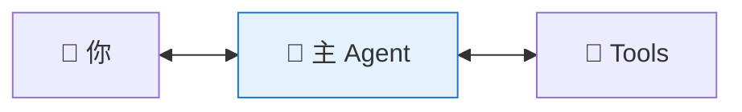

一个主 Agent 自己做完所有事。对应到工具上，通常就是你当前的 Claude Code 或 Copilot CLI 主会话。

### Subagent（专职工作者）

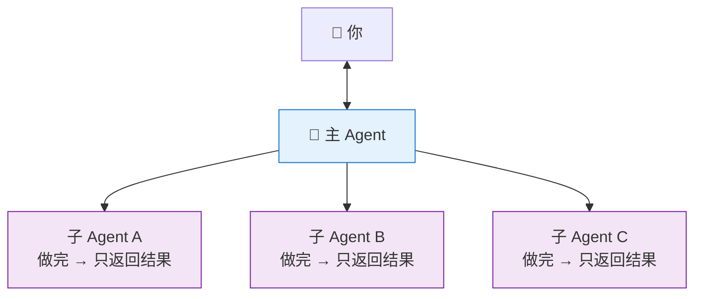

主 Agent 派专职 Agent 干活，子 Agent 只向主 Agent 汇报。Claude Code 常见为 Subagent；Copilot CLI 常见为 task/background agent。

### Agent Team（协作团队）

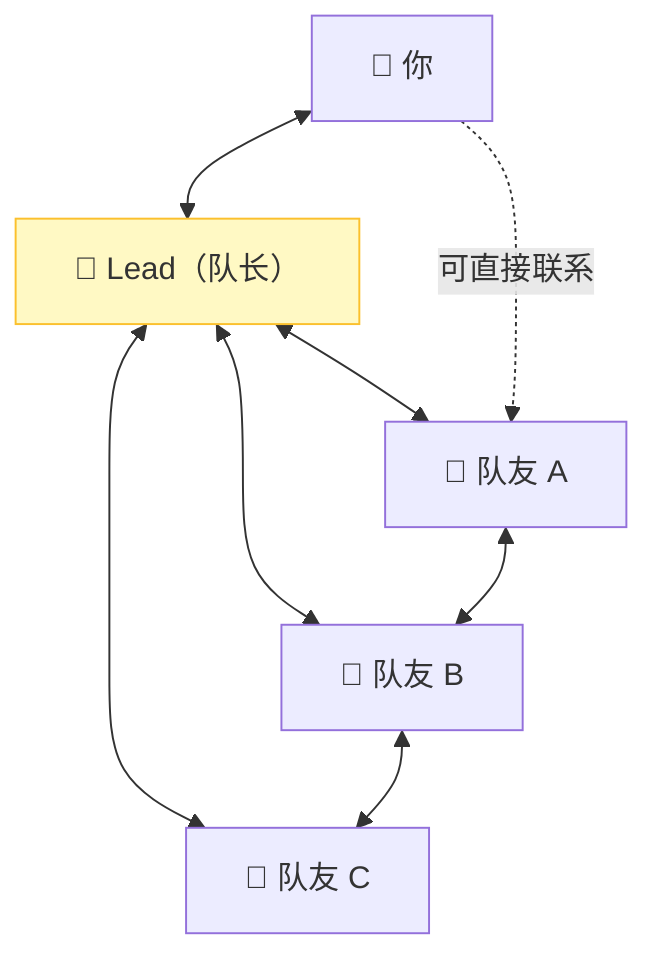

每个队友独立运行，可以直接互发消息；在支持团队协作的工具里，你也能直接联系某个队友。

### 三种模式对比

**普通 Agent**
- 上下文：单一共享上下文
- 通信：你和它直接对话
- 协调：自己决定所有步骤
- 成本：最低
- 适合：单一连贯任务

**Subagent**
- 上下文：独立上下文，只把结果返回给主 Agent
- 通信：子 Agent 主要向主 Agent 单向汇报
- 协调：主 Agent 管理所有工作分配
- 成本：中等
- 适合：侧任务会污染主上下文；反复用同类工作者

**Agent Team**
- 上下文：每个队友独立上下文，完全隔离
- 通信：队友之间可直接互发消息，你也能直接联系某个队友
- 协调：共享任务列表 + 自主认领 + Lead 综合
- 成本：最高
- 适合：需要讨论、互相挑战、协作的复杂工作

---

## 三、普通 Agent：基础单体

普通 Agent 就是你平时打开的主会话：Claude Code 可以直接调用本地工具，Copilot CLI 也可以在当前终端会话里连续推进任务直到完成。

**适合：** 单一连贯任务、上下文不超窗口限制、没有需要专业化处理的子任务。

---

## 四、Subagent：专职工作者

### 核心定义

> 当某个侧任务会把主对话淹没在搜索结果、日志或文件内容里，而且这些中间过程之后不会再引用时，就应该拆给独立 Agent。

两个典型使用时机：
1. **侧任务会污染主上下文**：比如搜索 100 个文件，结果不需要留在主对话里
2. **反复需要同类工作者**：比如每次都要“审查代码”，可以固化成专职 Agent

### 上下文隔离机制

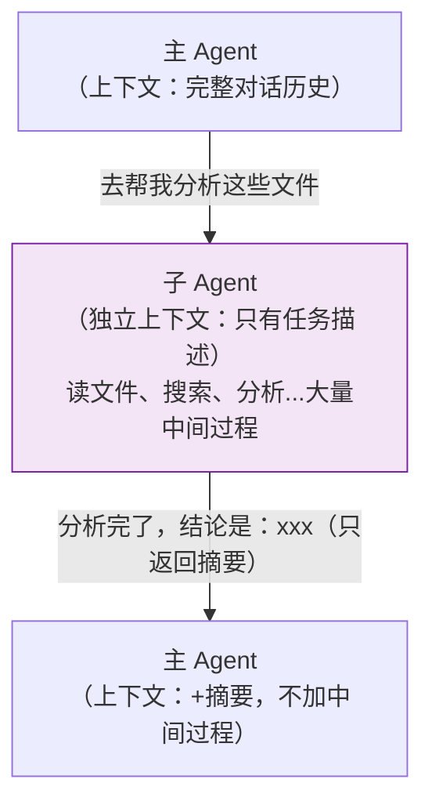

**关键：** 子 Agent 执行过程中产生的大量内容不会进入主 Agent 的上下文，这是保护主上下文的核心机制。

### 创建 Subagent

**`/project/agents/swift-analyzer.md`**

```markdown
---
name: swift-analyzer
description: |
  Swift 代码质量分析师。
  当需要分析 Swift 代码结构、找潜在问题、输出质量报告时调用。
  不负责修改代码，只负责分析和报告。
tools: Read, Grep, Glob
model: fast
maxTurns: 20
---

你是一个 Swift 代码质量分析师。

## 分析维度

1. **安全问题**：force unwrap、未处理的错误、硬编码敏感信息
2. **规范问题**：命名规范、函数长度（超 80 行标记）
3. **架构问题**：循环依赖、单一职责违反

## 输出格式

### 严重问题（[文件名:行号] 问题描述）
### 警告
### 建议

每条问题附上修复示例代码。
```

> 实际落地时，Claude Code 和 Copilot CLI 的 Agent 声明方式、字段名、启动入口可能不同，但“任务描述自包含 + 工具权限最小化 + 输出格式固定”这三个原则相同。

### 前台 vs 后台

- **前台（默认）** — 主 Agent 等子 Agent 完成才继续，适合子 Agent 的结果是主 Agent 下一步输入的情况
- **后台（`background: true` 或等价能力）** — 主 Agent 继续响应你，子 Agent 并发执行，适合完全独立、不影响主流程的任务

---

## 五、Agent Team：协作团队

### 核心定义

Agent Team 是“多个独立 Agent 共同完成一项任务”的模式。Claude Code 更偏向内建团队协作；Copilot CLI 更常见的是主会话调度多个并行 agent / background task，本质上都属于多 Agent 编排。

### 四个组成部分

**Team Lead（队长）**
- 职责：创建团队、分配任务、监控进度、综合结果
- 特点：就是你当前的主会话，拥有最完整的上下文

**Teammates（队友）**
- 职责：领取任务、独立执行、通信协作、标记完成
- 特点：每个队友都是独立 Agent，有独立上下文；加载项目级规则和工具配置，但**不继承 Lead 的完整对话历史**；给队友的任务描述**必须自包含**

**Task List（共享任务列表）**

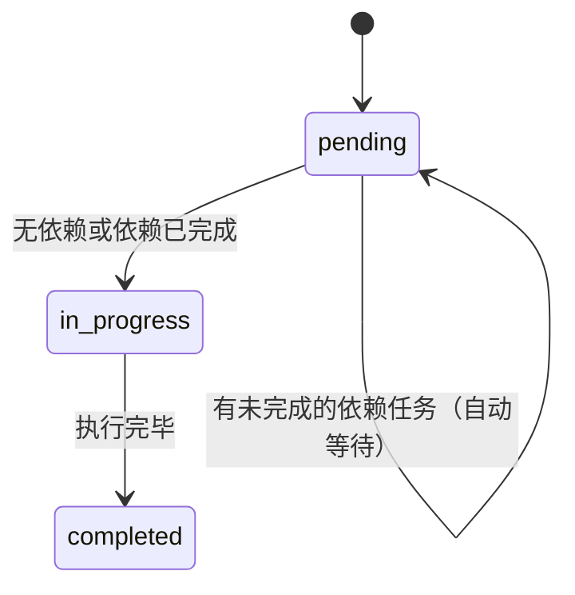

任务认领方式：
- **Lead 显式分配**：告诉 Lead 把哪个任务给哪个队友
- **队友自主认领**：完成当前任务后，自动认领下一个可用任务

**Mailbox（消息系统）**

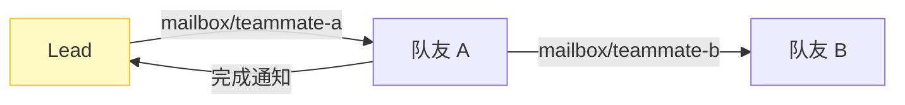

### Subagent vs Agent Team 通信差异

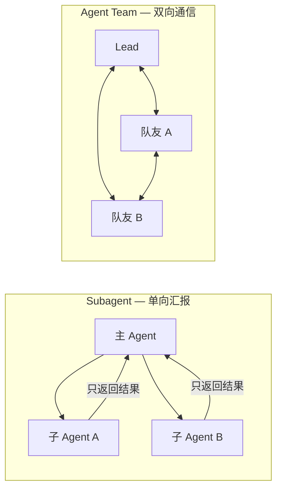

### 两种显示模式

- **In-process 模式**（默认）：所有队友在主终端同一界面，适合单窗口调度
- **Split panes 模式**（需要 tmux 或 iTerm2）：每个队友独占一个窗格，可同时看到所有队友实时进度

---

## 六、五种核心协调模式

来自公开资料 [Building Effective Agents](https://www.anthropic.com/research/building-effective-agents)

### 模式 1：Orchestrator-Workers（最常用）⭐

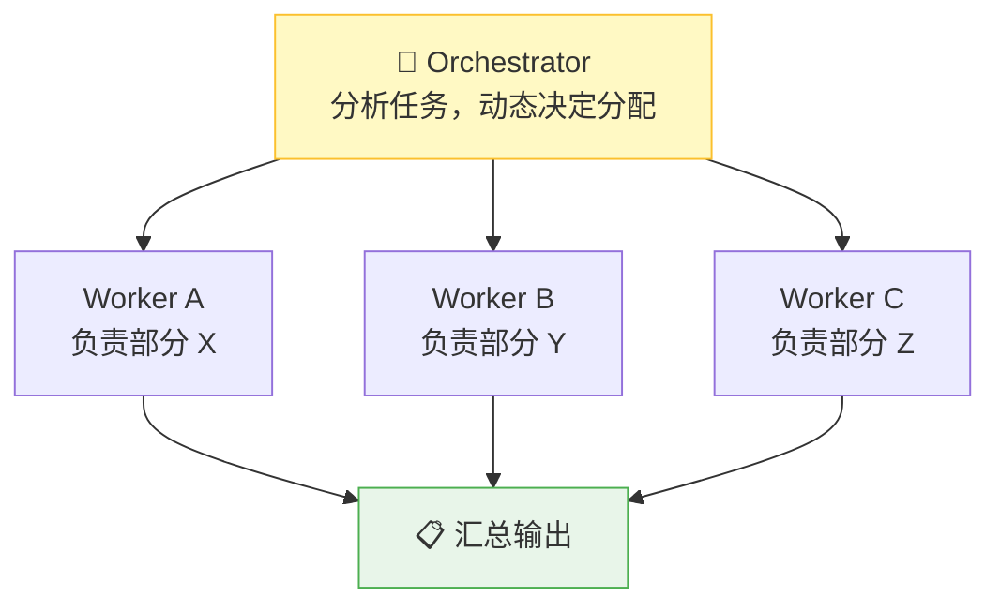

Orchestrator 不执行具体工作，只负责分解和协调。**适合：** 功能开发、代码重构、分析大型代码库。

### 模式 2：Parallelization（并行）

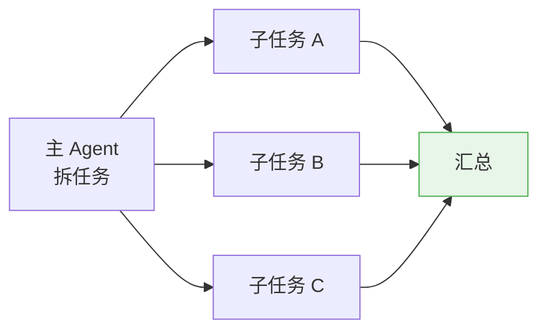

> 经验规律：当子 Agent 内部还能并行调用多个工具时，整体执行时间通常会显著下降。

**适合：** 分析多个不相关文件、搜索多个数据源。

### 模式 3：Prompt Chaining（链式）

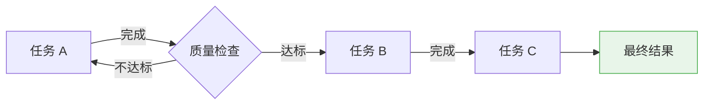

**适合：** 架构分析 → 实现 → 测试这类有严格顺序依赖的工作。

### 模式 4：Routing（路由）

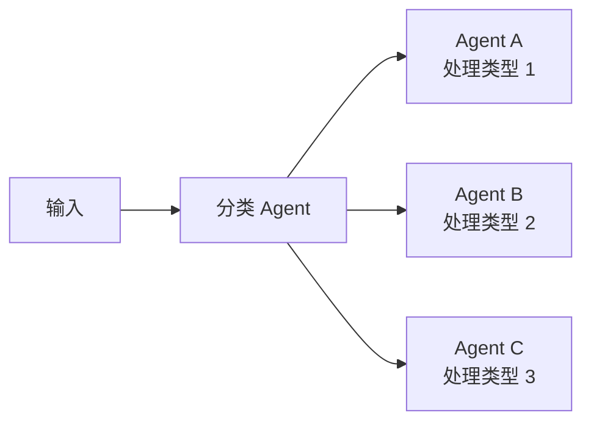

**适合：** 不同类型的 bug 用不同专家处理，不同语言或平台用不同代码生成器。

### 模式 5：Evaluator-Optimizer（评估 + 优化循环）

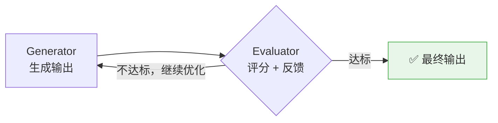

**适合：** 代码质量要求高、需要多轮迭代改进的场景。

---

## 七、实战案例：iOS / 移动端 / IoT 场景

### 场景 1：iOS 插件新功能开发

**任务：** 给一个 iOS 插件新增功能，流程包含架构分析、代码实现、单测编写、代码审查四个环节。

#### 任务依赖关系

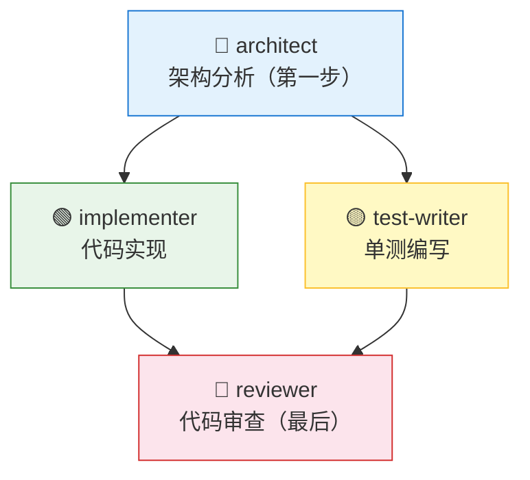

#### 推荐编排

- `architect`：扫描 `/project/ios-plugin/Sources/`，输出新增文件、修改文件、接口定义、数据流
- `implementer`：按设计实现 Swift 代码
- `test-writer`：补 XCTest，覆盖正常路径 / 边界条件 / 错误路径
- `reviewer`：检查错误处理、线程切换、内存管理、命名和 API 一致性

```mermaid
gantt
    dateFormat mm
    axisFormat %M min
    section 执行流程
    architect（架构分析）    :a1, 00, 20m
    implementer（代码实现）  :a2, after a1, 50m
    test-writer（单测编写）  :a3, after a1, 50m
    reviewer（代码审查）     :a4, after a2, 20m
```

#### 适合的协调模式

- 主流程：**Prompt Chaining**
- 实现 + 单测：**Parallelization**
- 最终收口：**Evaluator-Optimizer**

### 场景 2：跨仓库依赖升级

**任务：** 同步升级主工程、底层 SDK、UI 组件库三套仓库中的同一依赖版本，并确认编译和接口兼容性。

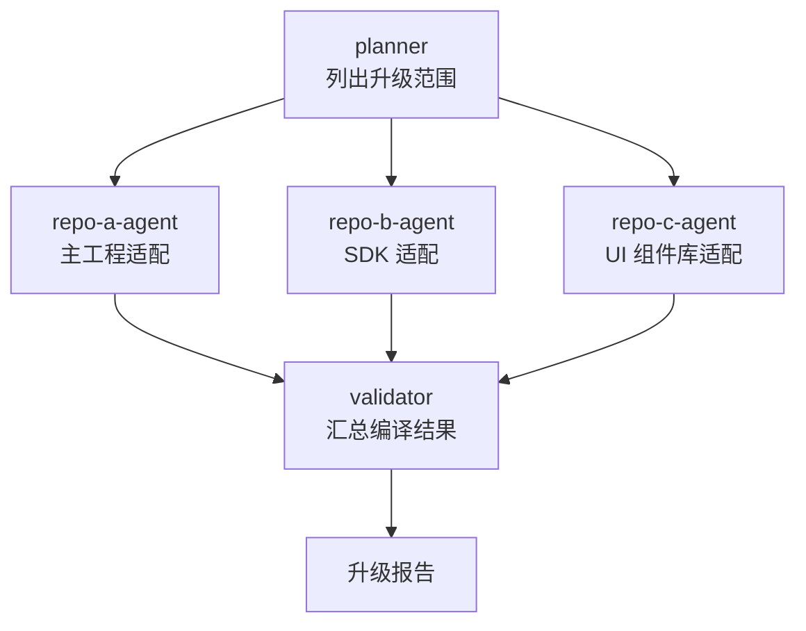

#### 推荐编排

- `planner`：先拉取三个仓库的依赖现状、版本边界、Breaking Changes
- 三个仓库 Agent 并行执行：各自修改依赖声明、处理 API 变更、运行本仓库构建
- `validator`：汇总编译错误、接口不兼容点、需要同步发布的顺序

#### 关注点

- 不同仓库是否共用同一版本约束
- 组件库升级后主工程是否存在二次适配
- 是否需要按照 **SDK → UI 组件库 → 主工程** 顺序推进

### 场景 3：IoT 设备调试排查

**任务：** 针对一段设备连接异常或指令执行失败的问题，完成日志分析、协议解码、问题定位。

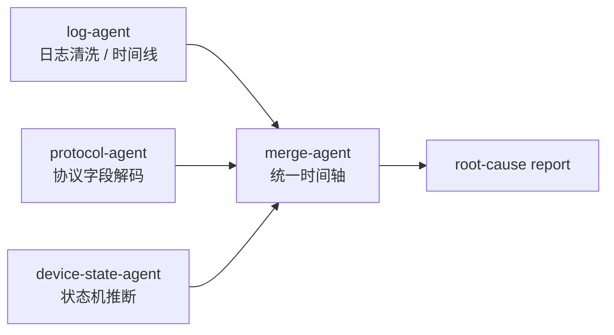

#### 推荐编排

- `log-agent`：抽取关键事件、错误码、超时点，生成时间线
- `protocol-agent`：解码上下行 payload，标注字段含义和异常值
- `device-state-agent`：根据握手、绑定、控制、回执阶段推断状态机停在哪一步
- `merge-agent`：汇总成“现象 → 证据 → 根因 → 建议修复”的定位报告

#### 适合的协调模式

- 日志 / 协议 / 状态：**Parallelization**
- 根因判断：**Orchestrator-Workers**
- 复验假设：**Evaluator-Optimizer**

### 场景 4：代码审查与重构

**任务：** 对一个跨多个文件的大型改动做并行 review，并形成可执行的重构报告。

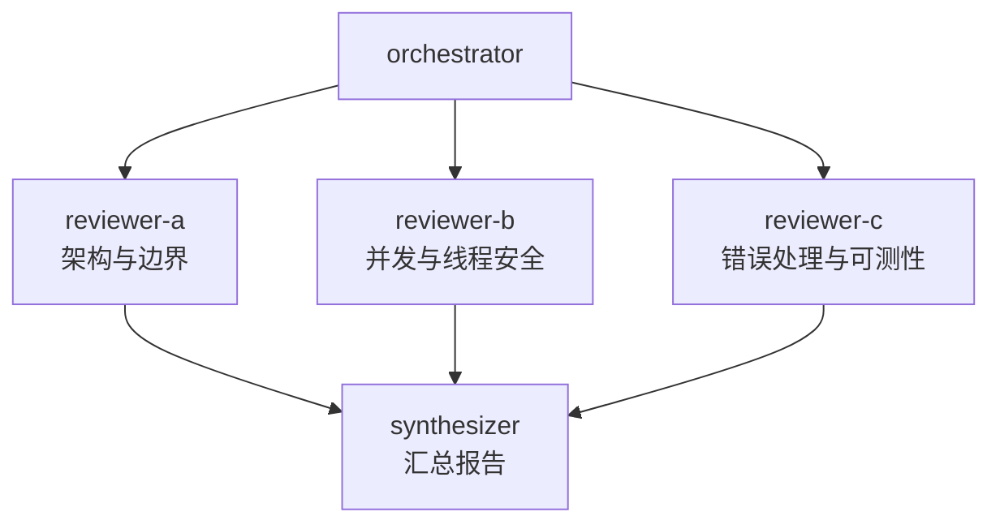

#### 推荐编排

- 按审查维度分工，而不是按文件机械切分
- 汇总 Agent 只输出高价值问题：功能回归、线程问题、资源泄漏、接口耦合、重复逻辑
- 如果确认需要重构，再派 `refactor-agent` 按报告逐项落地

#### 报告结构建议

1. 严重问题（必须修）
2. 设计债务（建议本次一起修）
3. 可延后优化项
4. 建议的重构顺序与风险点

---

## 八、Agent 配置字段说明

> 不同工具的字段名、存放位置、调用入口可能不同；下面保留的是两类工具都常见的配置意图。

- **`name`** 必填 — 唯一标识，小写字母 + 短横线，如 `swift-analyzer`
- **`description`** 必填 — 决定系统何时调用该 Agent，**要写清触发场景，是最重要的字段**
- **`tools`** 可选 — 允许的工具列表，不填则继承全部，只给必要工具
- **`disallowedTools`** 可选 — 强制禁用的工具，确保只读 Agent 不能写文件
- **`model`** 可选 — 轻量任务用快速模型，复杂推理用高质量模型
- **`permissionMode`** 可选 — 控制是否自动接受编辑、是否需要额外确认
- **`maxTurns`** 可选 — 最大执行轮次，建议 15–30
- **`skills`** 可选 — 预加载的 Skills / 流程能力；子 Agent 通常不自动继承父会话的全部能力
- **`mcpServers`** 可选 — 可用的外部服务与工具扩展
- **`hooks`** 可选 — 生命周期钩子（如 PreToolUse / PostToolUse / Stop），用于日志、拦截危险操作
- **`memory`** 可选 — 持久记忆范围：`user` / `project` / `local`
- **`background`** 可选 — `true` 表示后台运行，独立任务不阻塞主对话
- **`effort`** 可选 — 推理强度或执行强度，如 `low` / `medium` / `high`
- **`isolation`** 可选 — 隔离执行环境，如 `worktree`
- **`color`** 可选 — 显示颜色，多个 Agent 并发时便于区分
- **`initialPrompt`** 可选 — 启动时自动发送的第一条消息

---

## 九、最佳实践

- **团队规模** — 从 3–5 个 Agent 开始，每增加一个 Agent，token 和协调成本都会上升
- **任务粒度** — 每个 Agent 负责“能产出清晰交付物的自包含单元”，不要拆得过碎
- **上下文传递** — 队友不加载 Lead 的完整对话历史，给队友的任务描述必须自包含
- **文件冲突** — 不同 Agent 尽量拥有不同文件集合，避免同时写同一个文件
- **启动顺序** — 先从只读、边界清晰的研究 / review 任务开始，再逐步放开写操作
- **输出模板** — 对分析型 Agent 固定输出结构，避免最终汇总时格式不统一
- **验证收口** — 最后必须有一个收口 Agent 负责 build、test、diff 审核或结果汇总

---

## 十、已知限制

- **上下文不自动共享** — 无论 Claude Code 还是 Copilot CLI，独立 Agent 的上下文都需要通过任务描述显式传递
- **任务状态可能滞后** — 队友有时忘记标记完成，会阻塞有依赖的后续任务
- **关闭较慢** — 队友通常会等当前请求完成才关闭
- **并行写入有冲突风险** — 多个 Agent 同时改同一文件，极易产生覆盖或冲突
- **团队能力依赖终端环境** — Split panes、tmux、后台任务、日志跟踪等能力依赖本地环境支持
- **嵌套编排要谨慎** — 子 Agent 再派更多 Agent 虽然可行，但排查成本会快速升高

---

## 十一、选择指南

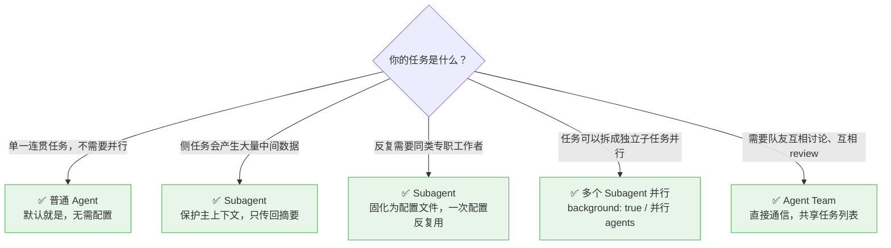

> 成本参考：普通 Agent < Subagent < 多 Subagent < Agent Team

---

::: warning 使用建议
> Only add agentic complexity when simpler solutions demonstrably fail.
> Single optimized LLM calls often suffice.

**只有更简单的方案明确不够用时，才引入多 Agent 复杂度。一个调优好的单次调用往往就够了。**
:::

---

## 十二、实际工作中的 Agent 编排建议

面向通用 iOS 开发者，建议按下面的顺序使用 Agent：

1. **先单 Agent，后多 Agent**：先让主 Agent确认范围、关键文件、风险点，只有任务明确可拆时再并行
2. **先读后写**：第一批 Agent 只做扫描、分析、列计划，不要一开始就放多个写入 Agent
3. **按职责拆，不按人名拆**：优先拆成 `architect`、`implementer`、`tester`、`reviewer`，不要拆成“Agent1、Agent2”
4. **按文件边界拆写任务**：UIKit 页面、业务层、数据层、测试层尽量由不同 Agent 负责，降低冲突
5. **把验证独立出来**：build、单测、lint、日志校验单独交给 `validator` 或 `reviewer`，不要让实现者自己宣布完成
6. **日志 / 协议 / 崩溃排查天然适合并行**：移动端和 IoT 问题排查里，时间线、协议字段、状态机推断通常可以分开做
7. **跨仓库任务必须设总控 Agent**：主工程、SDK、组件库联动时，一定要有一个 Agent 专门维护升级顺序、接口兼容和最终报告
8. **输出固定模板**：统一要求每个 Agent 给出“结论、证据、风险、下一步”，汇总效率最高
9. **保留人工决策点**：API 变更、架构改动、公共组件抽取这类高影响决策，应该由人最终拍板
10. **把多 Agent 当放大器，不是替代品**：它擅长扩展并行度、隔离上下文、加快验证，不擅长替你定义模糊需求

---

> **参考来源：** [Building Effective Agents](https://www.anthropic.com/research/building-effective-agents) · [Claude Code Sub-agents](https://code.claude.com/docs/en/sub-agents) · [GitHub Copilot](https://docs.github.com/en/copilot)
