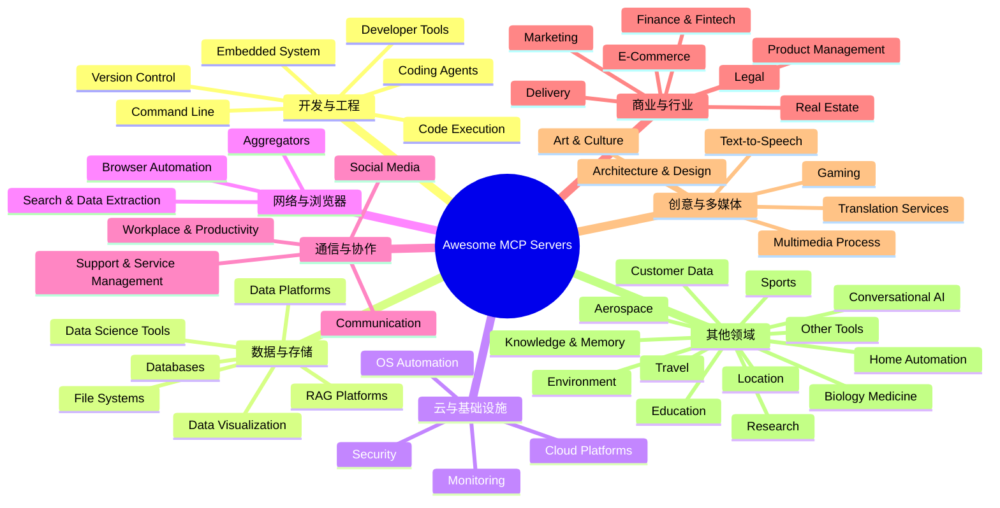

# Awesome MCP Servers — 社区 MCP Server 大全
> 适用对象：Claude Code、GitHub Copilot CLI、Cursor、Windsurf 等 MCP Host 使用者  
> 更新日期：2026-05-11  
> 阅读目标：快速理解 awesome-mcp-servers 的结构、分类、选型方法与开发者常用清单
## 简介
- **awesome-mcp-servers** 是一个由社区持续维护的 MCP Server 大全，收录 **2200+ MCP Servers**、覆盖 **50+ categories**。
- 仓库维护者是 **punkpeye**，它已经成为 MCP 生态里最常被引用、最容易入门、也最适合做“发现新能力”入口的资源之一。
- GitHub：<https://github.com/punkpeye/awesome-mcp-servers>
- 它的重要性在于：你不需要分别去搜索“有没有 GitHub MCP”“有没有 Notion MCP”“有没有 Figma MCP”，而是可以在一个地方做能力发现、分类筛选、安装跳转和生态跟踪。

### 按领域分类速查

| 分类 | 典型 Server | 说明 |
|------|------------|------|
| **开发工具** | GitHub、GitLab、Sentry、Linear | 版本控制、Issue 管理、错误监控 |
| **数据库** | PostgreSQL、MySQL、MongoDB、Redis | 数据库查询与管理 |
| **浏览器自动化** | Puppeteer、Playwright、Browserbase | 网页抓取、UI 测试、自动化 |
| **云平台** | AWS、GCP、Azure、Cloudflare | 云资源管理与部署 |
| **办公协作** | Confluence、Jira、Notion、Slack、Google Drive | 文档、项目管理、沟通 |
| **文件系统** | Filesystem、S3、Google Drive | 文件读写与管理 |
| **搜索与数据** | Brave Search、Google Search、Exa | 网页搜索与数据提取 |
| **AI 与知识** | RAG 平台、Memory、Knowledge Graph | 检索增强生成、知识管理 |
| **设计** | Figma、Canva | 设计稿读取与操作 |
| **通信** | Email、Discord、Telegram、WeChat | 消息收发 |
| **金融** | Stripe、Plaid、Crypto API | 支付、银行、加密货币 |
| **监控** | Datadog、Grafana、Prometheus | 系统监控与告警 |
| **安全** | Vault、1Password、Security Scanner | 密钥管理与安全扫描 |
| **多媒体** | FFmpeg、Image Processing、TTS | 音视频处理、文字转语音 |
| **其他** | Home Automation、Gaming、Education | 智能家居、游戏、教育 |

---
## 如何使用
### 1. 先在 GitHub 浏览仓库
README 按类别整理 server，先看目录再进分类，通常就够做第一轮筛选。

### 2. 按 category 搜索
- 很明确要什么时，直接按分类进入：
- 想读数据库：看 **Databases**
- 想抓网页：看 **Browser Automation** 或 **Search & Data Extraction**
- 想接 GitHub / GitLab：看 **Version Control**
- 想接 Slack / Teams / Email：看 **Communication**
- 想做 RAG：看 **RAG Platforms** 或 **Knowledge & Memory**

### 3. 大多数 server 都支持 `npx` 或 `pip`/`uvx` 安装
主要发布形态通常是：
- **Node.js**：常见安装方式是 `npx -y <package>`
- **Python**：常见安装方式是 `pip install <package>` 或 `uvx <package>`
- **Docker / Hosted**：更适合团队统一托管、SSE / HTTP 远程访问
- **本地二进制**：常见于 Go / Rust / Java 生态

### 4. 配置到 Claude Code 或 Copilot CLI
- 常见配置位置：
- **Claude Code**：`~/.claude/mcp.json`
- **GitHub Copilot CLI**：`~/.copilot/mcp.json`

### 5. Quick install example
常见本地配置示例：

```json
{
  "mcpServers": {
    "filesystem": {
      "command": "npx",
      "args": [
        "-y",
        "@modelcontextprotocol/server-filesystem",
        "/Users/jinhui.zhang/Desktop/claude-docs"
      ]
    },
    "playwright": {
      "command": "npx",
      "args": ["-y", "@playwright/mcp@latest"]
    }
  }
}
```

### 6. 安装前先做四个检查
- 依次确认 transport、读写权限、认证方式、维护状态。

---
## 分类总览
下面把 50 个分类重组为 8 个更适合中文读者理解的大类。



### 🔧 开发与工程
| 项目 | 内容 |
|---|---|
| 类别定位 | 💻 Developer Tools：IDEs、调试、代码分析、变更追踪与开发环境管理。 |
| 代表 Server 1 | `marin1321/mcp-devtools`：把 filesystem、database、process、OpenAPI 等本地开发能力统一收口，适合做一个“全能开发工具箱”。 |
| 代表 Server 2 | `CSCSoftware/AiDex`：基于 Tree-sitter 做持久化代码索引，适合大型仓库的语义级搜索与定位。 |
| 代表 Server 3 | `a-25/ios-mcp-code-quality-server`：面向 iOS / Xcode / SwiftLint / test execution 的质量分析，适合 Apple 平台开发。 |
| 选择建议 | 如果你先要“看懂代码”，优先索引型工具；如果先要“调环境”，优先 devtools；如果有平台特定约束，就选领域专用 server。 |
| 项目 | 内容 |
|---|---|
| 类别定位 | 👨‍💻 Code Execution：为 coding agent 提供受控、隔离、可审计的代码执行环境。 |
| 代表 Server 1 | `asif-nvc/e2b-sandbox-mcp`：把 E2B sandbox 暴露成 MCP，适合云端安全执行 Python / Node 任务。 |
| 代表 Server 2 | `alfonsograziano/node-code-sandbox-mcp`：更偏本地或 Node 生态的代码沙箱，适合快速运行样例与实验代码。 |
| 代表 Server 3 | `dagger/container-use`：通过容器化方式执行任务，适合需要可复现环境、依赖隔离与 CI 风格流程。 |
| 选择建议 | 这类 server 重点看隔离级别、网络权限、持久化策略与日志审计能力，生产环境不要只看“能跑”。 |
| 项目 | 内容 |
|---|---|
| 类别定位 | 🤖 Coding Agents：完整自治型 coding agents，可读写代码、执行命令、规划任务。 |
| 代表 Server 1 | `agent-blueprint/mcp-server`：提供通用 agent 能力接口，适合把独立 agent 暴露给任意 MCP host。 |
| 代表 Server 2 | `askbudi/roundtable`：更适合多 agent 协同讨论、分工与汇总，适合复杂调研或多步骤工程任务。 |
| 代表 Server 3 | `agentic-mcp-tools/owlex`：更强调 agent tool orchestration，把多个能力组合成自主执行链路。 |
| 选择建议 | 如果你的目标是“让工具会做事”而不是“只会查资料”，这一类通常比单一工具 server 更有价值。 |
| 项目 | 内容 |
|---|---|
| 类别定位 | 🖥️ Command Line：Shell 交互、命令执行、输出捕获与终端自动化。 |
| 代表 Server 1 | `raychao-oao/pty-mcp`：基于 PTY 的终端交互，更适合需要实时 stdout / stdin 的会话型命令。 |
| 代表 Server 2 | `danmartuszewski/hop`：把常见命令行操作包装成可控入口，适合减少 AI 直接执行任意 shell 的风险。 |
| 代表 Server 3 | `ferodrigop/forge`：偏工程化命令调度与输出封装，适合批量脚本与 build workflow。 |
| 选择建议 | 命令行类 server 要重点控制 allowlist、工作目录、超时与 destructive command policy。 |
| 项目 | 内容 |
|---|---|
| 类别定位 | 🔄 Version Control：Git、GitHub、GitLab、PR 处理与仓库读写。 |
| 代表 Server 1 | `github/github-mcp-server`：最常见的 GitHub 集成之一，适合 issue、PR、check runs、repo file 读写。 |
| 代表 Server 2 | `gitea/gitea-mcp`：适合自建 Git 服务场景，尤其是内网或私有仓库团队。 |
| 代表 Server 3 | `ddukbg/github-enterprise-mcp`：面向 GitHub Enterprise，适合企业内网与合规约束环境。 |
| 选择建议 | 如果团队已经把开发流程绑在 PR / issue / review 上，这一类通常是第一批该接的 MCP Server。 |
| 项目 | 内容 |
|---|---|
| 类别定位 | 📟 Embedded System：嵌入式设备文档、串口、调试器、硬件快捷操作。 |
| 代表 Server 1 | `adancurusul/embedded-debugger-mcp`：把调试器操作暴露给 AI，适合 MCU / firmware 调试辅助。 |
| 代表 Server 2 | `adancurusul/serial-mcp-server`：面向 serial/串口交互，适合抓日志、发命令、看设备响应。 |
| 代表 Server 3 | `horw/esp-mcp`：更偏 ESP 系列设备与 IoT 开发者常见场景。 |
| 选择建议 | 这类 server 的关键不是“工具多”，而是协议稳定、硬件安全边界清楚、不会误伤真实设备。 |
### 🗄️ 数据与存储
| 项目 | 内容 |
|---|---|
| 类别定位 | 🗄️ Databases：PostgreSQL、MySQL、MongoDB、Redis、SQLite 等数据库访问与 schema inspection。 |
| 代表 Server 1 | `modelcontextprotocol/server-postgres`：官方系 PostgreSQL server，适合 schema inspection、查询与分析。 |
| 代表 Server 2 | `modelcontextprotocol/server-sqlite`：轻量、上手快，特别适合本地工具库、日志库、小型分析任务。 |
| 代表 Server 3 | `redis/mcp-redis`：官方 Redis MCP Server，适合 key/value、向量检索、缓存检查与数据运营。 |
| 选择建议 | 数据库类 server 要优先检查读写权限、SQL 注入防护、默认只读模式与 explain / schema 能力。 |
| 项目 | 内容 |
|---|---|
| 类别定位 | 📊 Data Platforms：数据集成、转换、流式处理与 pipeline orchestration。 |
| 代表 Server 1 | `confluentinc/mcp-confluent`：适合 Kafka / Confluent Cloud 场景，能把流式数据平台能力交给 AI。 |
| 代表 Server 2 | `tinybirdco/mcp-tinybird`：适合事件数据、分析型 API 与实时数据产品。 |
| 代表 Server 3 | `jovezhong/mcp-timeplus`：把 Kafka + streaming SQL 的思路带进 MCP，适合实时数据排查与分析。 |
| 选择建议 | 如果你要的是“数据链路”而不只是“数据库查询”，优先考虑 Data Platforms，而不是把所有问题都塞给 DB server。 |
| 项目 | 内容 |
|---|---|
| 类别定位 | 🧮 Data Science Tools：数据探索、分析、统计建模与 ML workflow。 |
| 代表 Server 1 | `arrismo/kaggle-mcp`：适合把 Kaggle 数据集、竞赛上下文、实验流程拉进 AI。 |
| 代表 Server 2 | `abhiphile/fermat-mcp`：偏数学与分析计算场景，适合理工科推导与实验辅助。 |
| 代表 Server 3 | `embeddedlayers/mcp-analytics`：针对业务数据做统计、预测与交互式报告，适合 analyst / growth 团队。 |
| 选择建议 | 如果问题核心是“算”和“分析”，而不是“取数”，这一类比纯数据库 server 更合适。 |
| 项目 | 内容 |
|---|---|
| 类别定位 | 📈 Data Visualization：图表、dashboard、流程图、可视化数据表达。 |
| 代表 Server 1 | `antv/mcp-server-chart`：基于 AntV 生成图表，适合 BI、报表与嵌入式可视化。 |
| 代表 Server 2 | `hustcc/mcp-echarts`：适合前端常见 ECharts 工作流，生成成本低、生态成熟。 |
| 代表 Server 3 | `hustcc/mcp-mermaid`：适合结构图、流程图、时序图与轻量技术可视化。 |
| 选择建议 | 当你发现 AI 输出大量文字但人还是难理解时，就该优先补一层 visualization server。 |
| 项目 | 内容 |
|---|---|
| 类别定位 | 📂 File Systems：本地文件读写、目录浏览、权限隔离与文件管理。 |
| 代表 Server 1 | `modelcontextprotocol/server-filesystem`：最常见的基础设施型 MCP Server，适合受控目录读写。 |
| 代表 Server 2 | `8b-is/smart-tree`：更偏目录结构理解与树形浏览，适合大型项目快速扫目录。 |
| 代表 Server 3 | `box/mcp-server-box-remote`：把 Box 一类远程文件系统接入 AI，适合企业文档库。 |
| 选择建议 | 生产环境里不要给 filesystem server 全盘权限；按目录白名单切分，远比“能访问所有文件”更重要。 |
| 项目 | 内容 |
|---|---|
| 类别定位 | 🔎 RAG Platforms：Retrieval-Augmented Generation 的端到端平台与检索链路。 |
| 代表 Server 1 | `vectara/vectara-mcp`：适合快速把检索、embedding、问答整合到现成平台。 |
| 代表 Server 2 | `gogabrielordonez/mcp-ragchat`：更适合轻量 RAG Chat 场景，部署与验证门槛较低。 |
| 代表 Server 3 | `devflowinc/trieve`：覆盖 crawl、chunk、embed、search、retrieve 的完整链路，适合“从原始网页到知识问答”一站式流程。 |
| 选择建议 | 当你不想自己拼 embedding + vector store + rerank + retrieval 时，RAG 平台类会省掉大量集成成本。 |
### ☁️ 云与基础设施
| 项目 | 内容 |
|---|---|
| 类别定位 | ☁️ Cloud Platforms：AWS、GCP、Azure、Cloudflare 等云基础设施管理。 |
| 代表 Server 1 | `aashari/mcp-server-aws-sso`：适合 AWS SSO 场景，把多账号访问与资源操作接入 AI。 |
| 代表 Server 2 | `4everland/4everland-hosting-mcp`：更偏 hosting / deploy 场景，适合把云端发布动作标准化。 |
| 代表 Server 3 | `arnstarn/mcp-server-spotinst`：适合云资源优化、成本控制与弹性计算运营。 |
| 选择建议 | 云平台类 server 首先要确认账号边界、最小权限、审计日志与回滚路径。 |
| 项目 | 内容 |
|---|---|
| 类别定位 | 📊 Monitoring：Datadog、Sentry、error reports、performance metrics 与观测数据。 |
| 代表 Server 1 | `avivsinai/langfuse-mcp`：适合 LLM app 观测、trace 分析、prompt 质量回看。 |
| 代表 Server 2 | `alilxxey/openobserve-community-mcp`：适合日志检索与社区版可观测平台接入。 |
| 代表 Server 3 | `clamp-sh/mcp`：更偏开发期 observability，把排障信息直接送进 AI workflow。 |
| 选择建议 | 如果你的目标是“先定位问题再修”，Monitoring 往往比更多工具更能直接提高 AI 效率。 |
| 项目 | 内容 |
|---|---|
| 类别定位 | 🔒 Security：密码库、密钥管理、安全扫描、 provenance 与风险分析。 |
| 代表 Server 1 | `alexfleetcommander/agent-trust-stack-mcp`：强调 AI agent 可信执行链路，适合 agent governance。 |
| 代表 Server 2 | `123Ergo/unphurl-mcp`：适合 URL / IOC 解析、溯源与安全分析。 |
| 代表 Server 3 | `13bm/GhidraMCP`：把逆向分析工具链接入 MCP，适合二进制分析与安全研究。 |
| 选择建议 | 安全类 server 不只看功能，更要看 secrets handling、脱敏、审计与是否支持只读模式。 |
| 项目 | 内容 |
|---|---|
| 类别定位 | 🖱️ OS Automation：截图、窗口管理、键盘鼠标、桌面交互与本机自动化。 |
| 代表 Server 1 | `sbuysse/gnome-desktop-mcp`：面向 Linux 桌面自动化，适合截图、窗口与 UI 流程操作。 |
| 代表 Server 2 | `dimpagk92/cellar`：偏系统级操作与桌面控制，适合把“本机动作”变成可调用工具。 |
| 代表 Server 3 | `ContextPulse/contextpulse`：更偏桌面上下文采集：OCR、语音、键鼠活动、剪贴板与行为历史。 |
| 选择建议 | OS Automation 很强，但也是风险最高的一类；建议只在个人开发机或隔离环境中开启。 |
### 🌐 网络与浏览器
| 项目 | 内容 |
|---|---|
| 类别定位 | 🌍 Browser Automation：网页访问、搜索、抓取、表单操作与浏览器自动化。 |
| 代表 Server 1 | `microsoft/playwright-mcp`：适合真实浏览器驱动、登录态页面、截图、测试与自动操作。 |
| 代表 Server 2 | `modelcontextprotocol/server-puppeteer`：适合 Chrome/Puppeteer 生态，轻量网页抓取与自动化很常见。 |
| 代表 Server 3 | `apireno/DOMShell`：更偏 DOM 层交互和页面结构操作，适合提取结构化信息。 |
| 选择建议 | 如果页面需要登录、点击、等待异步渲染，优先 Playwright / Puppeteer；纯静态抓取可用更轻量方案。 |
| 项目 | 内容 |
|---|---|
| 类别定位 | 🔎 Search & Data Extraction：Brave Search、Google Search、YouTube transcripts、网页清洗与结构化抽取。 |
| 代表 Server 1 | `brave/brave-search-mcp-server`：最常见的通用 web search server 之一，适合补实时信息。 |
| 代表 Server 2 | `mrslbt/rippr`：专注 YouTube transcript，适合视频内容检索、摘要与引用。 |
| 代表 Server 3 | `AIMLPM/markcrawl`：把网页抓成干净 Markdown 或结构化数据，适合 research 与 RAG 预处理。 |
| 选择建议 | 搜索类 server 的关键是结果质量、引用能力、速率限制与是否能把页面清洗成模型友好格式。 |
| 项目 | 内容 |
|---|---|
| 类别定位 | 🔗 Aggregators：通过一个 MCP server 统一接多个 app 与工具。 |
| 代表 Server 1 | `1mcp/agent`：聚合多个 MCP server 到单入口，适合减少 host 端配置负担。 |
| 代表 Server 2 | `tadas-github/a2asearch-mcp`：既能聚合，也偏 discovery，用来搜索大量 MCP servers / agent tools。 |
| 代表 Server 3 | `Aganium/agenium`：更偏 bridge / gateway 思路，适合把异构工具统一暴露。 |
| 选择建议 | 当团队的 MCP 清单越来越长时，aggregator 能降低配置复杂度，但也会提高单点故障与权限集中风险。 |
### 💬 通信与协作
| 项目 | 内容 |
|---|---|
| 类别定位 | 💬 Communication：Slack、Discord、Telegram、Email、WeChat、Teams 等通信集成。 |
| 代表 Server 1 | `agentmail-toolkit/mcp`：给 AI 动态创建邮箱、收发邮件，非常适合自动化注册、通知与客服流。 |
| 代表 Server 2 | `InditexTech/mcp-teams-server`：适合 Microsoft Teams 读写消息、@成员、线程操作。 |
| 代表 Server 3 | `Beltran12138/wecom-docs-mcp-server`：补齐 WeCom 文档读写场景，适合中文企业协作环境。 |
| 选择建议 | 通信类 server 涉及外发动作，建议明确区分“可读”“可发”“可群发”“可删除”四类权限。 |
| 项目 | 内容 |
|---|---|
| 类别定位 | 🏢 Workplace & Productivity：Calendar、Docs、Drive、Notion、任务、日程、时间管理。 |
| 代表 Server 1 | `conorbronsdon/gws-mcp-server`：一口气接入 Google Workspace：Drive、Sheets、Docs、Calendar、Gmail。 |
| 代表 Server 2 | `n24q02m/better-notion-mcp`：Markdown-first 的 Notion server，适合知识库、会议纪要、任务库协同。 |
| 代表 Server 3 | `takumi0706/google-calendar-mcp`：适合纯日程与排期场景，轻量且目标明确。 |
| 选择建议 | 这组最适合先做“个人工作台自动化”：查日程、写文档、同步笔记、跟踪任务。 |
| 项目 | 内容 |
|---|---|
| 类别定位 | 🎧 Support & Service Management：Helpdesk、IT service management、工单与客户服务。 |
| 代表 Server 1 | `effytech/freshdesk-mcp`：适合客服团队读写 ticket、跟进处理状态。 |
| 代表 Server 2 | `nguyenvanduocit/jira-mcp`：适合 issue / bug / project workflow，开发团队最常见。 |
| 代表 Server 3 | `aikts/yandex-tracker-mcp`：偏 tracker / 工单管理场景，适合国际化或多平台组织。 |
| 选择建议 | 如果你的 AI 需要“接工单—查资料—回用户—更新状态”，这组就是自动化闭环的核心。 |
| 项目 | 内容 |
|---|---|
| 类别定位 | 🌐 Social Media：内容发布、互动、账号运营与社媒数据分析。 |
| 代表 Server 1 | `06ketan/substack-ops`：适合 newsletter / Substack 内容运营。 |
| 代表 Server 2 | `anwerj/youtube-uploader-mcp`：适合视频上传、描述维护与内容发布流水线。 |
| 代表 Server 3 | `arjun1194/insta-mcp`：适合 Instagram 发布与简单互动管理。 |
| 选择建议 | 社媒类 server 适合 marketing/creator 场景，但一定要先确认平台 API 限制与账号风控规则。 |
### 💼 商业与行业
| 项目 | 内容 |
|---|---|
| 类别定位 | 💳 Finance & Fintech：Stripe、Plaid、crypto、payment gateway、汇率与交易。 |
| 代表 Server 1 | `stripe`：最常见的支付类 MCP 选择之一，适合 payment intent、customer、invoice 与 billing workflow。 |
| 代表 Server 2 | `mrslbt/xendit-mcp`：面向东南亚支付网关，适合 invoice、disbursement 与转账流程。 |
| 代表 Server 3 | `@arbitova/mcp-server`：更偏 on-chain escrow 与 agent-to-agent payment，适合 web3 / agent economy。 |
| 选择建议 | 支付类 server 一定要先看 sandbox、幂等、退款能力、风控与 webhook 对接方式。 |
| 项目 | 内容 |
|---|---|
| 类别定位 | 🛒 E-Commerce：在线商城、卖家后台、商品与订单管理。 |
| 代表 Server 1 | `MarceauSolutions/amazon-seller-mcp`：适合 Amazon Seller Central 运营：库存、订单、销售分析。 |
| 代表 Server 2 | `agentlux/agentlux-mcp`：更偏 agent 化电商运营工作流。 |
| 代表 Server 3 | `laundromatic/shopgraph`：适合商品、店铺与销售数据关系的结构化管理。 |
| 选择建议 | 电商类 server 的高价值点通常不是“查单”，而是把商品、订单、营销、客服串成完整运营闭环。 |
| 项目 | 内容 |
|---|---|
| 类别定位 | 🎯 Marketing：SEO、广告投放、内容创建、增长分析与品牌定位。 |
| 代表 Server 1 | `acamolese/google-search-console-mcp`：适合 SEO 排查、搜索分析、URL inspection 与 sitemap 管理。 |
| 代表 Server 2 | `AdsMCP/tiktok-ads-mcp-server`：适合广告投放自动化与素材 / campaign 运营。 |
| 代表 Server 3 | `Brand-System/brandsystem-mcp`：适合品牌表达、一致性与内容策略。 |
| 选择建议 | 营销类 server 最适合接在“研究—生成—投放—分析”链路里，而不是孤立使用。 |
| 项目 | 内容 |
|---|---|
| 类别定位 | 📋 Product Management：产品规划、客户反馈分析、优先级排序与 roadmap。 |
| 代表 Server 1 | `dkships/pm-copilot`：把支持工单与 feature request 合并分析，适合 PM 做主题聚类与优先级。 |
| 代表 Server 2 | `Lukaris/framedeck-mcp`：适合内容产品或 creator 团队的生产看板管理。 |
| 代表 Server 3 | `spranab/saga-mcp`：提供 Jira-like 项目追踪与依赖管理，适合 agent 原生项目流。 |
| 选择建议 | 如果团队希望 AI 直接参与需求归因、主题聚类、RICE / ICE 打分，这一类非常值得接。 |
| 项目 | 内容 |
|---|---|
| 类别定位 | 🏠 Real Estate：房地产 CRM、房源管理、带看与经纪人 workflow。 |
| 代表 Server 1 | `ashev87/propstack-mcp`：目前该分类里很有代表性的 real estate CRM server，支持联系人、房源、deal、viewing 管理。 |
| 代表 Server 2 | `8randonpickart5/alderpost-mcp`：虽然是聚合型 server，但内含 property intelligence 端点，可作为房产数据补充入口。 |
| 代表 Server 3 | `human-pages-ai/humanpages`：不属于传统地产 CRM，但在人力与本地服务撮合场景里可与房产运营工作流结合。 |
| 选择建议 | 这类分类当前还不算大热门，选型时更要看是否贴合你的业务模型，而不是只看 stars。 |
| 项目 | 内容 |
|---|---|
| 类别定位 | ⚖️ Legal：法律数据库、法规检索、法案对照与法律研究。 |
| 代表 Server 1 | `ark-forge/mcp-eu-ai-act`：适合 EU AI Act 等法规检索、合规问答与条款定位。 |
| 代表 Server 2 | `JamesANZ/us-legal-mcp`：偏美国法律研究与法规搜索。 |
| 代表 Server 3 | `gavelin-ai/mcp`：更偏法律辅助与法律文本处理工作流。 |
| 选择建议 | 法律类 server 适合做 research 与草案辅助，但最终法律判断仍需专业律师或合规团队把关。 |
| 项目 | 内容 |
|---|---|
| 类别定位 | 🚚 Delivery：DoorDash 与配送服务、物流、邮寄与派送。 |
| 代表 Server 1 | `jordandalton/doordash-mcp-server`：典型的外卖 / 配送服务接入，适合下单与配送类动作。 |
| 代表 Server 2 | `aarsiv-groups/shipi-mcp-server`：适合更广义的 shipping / logistics automation。 |
| 代表 Server 3 | `catrinmdonnelly/royalmail-mcp`：适合英国邮政 / 邮寄场景。 |
| 选择建议 | 配送类 server 适合和电商、客服、订单系统联动使用，单独接入价值通常不如组合使用。 |
### 🎨 创意与多媒体
| 项目 | 内容 |
|---|---|
| 类别定位 | 🖼️ Art & Culture：艺术馆藏、文化遗产、博物馆数据库与创意内容。 |
| 代表 Server 1 | `8enSmith/mcp-open-library`：适合图书与公开文化资料检索。 |
| 代表 Server 2 | `AceDataCloud/MCPFlux`：偏创意图像与文化内容生成 / 获取场景。 |
| 代表 Server 3 | `abhiemj/manim-mcp-server`：更适合把教育、数学、艺术表达转成可视化动画。 |
| 选择建议 | 这一类适合 research、内容创作与策展辅助，不只是“找图片”，更重要是把文化资料结构化。 |
| 项目 | 内容 |
|---|---|
| 类别定位 | 📐 Architecture & Design：软件架构图、系统可视化、流程图与设计表达。 |
| 代表 Server 1 | `BV-Venky/excalidraw-architect-mcp`：适合快速生成草图式架构图，表达系统边界与关系很直观。 |
| 代表 Server 2 | `GittyBurstein/mermaid-mcp-server`：适合代码仓库里直接维护 diagram-as-code。 |
| 代表 Server 3 | `betterhyq/mermaid-grammer-inspector-mcp`：适合校验与修正 Mermaid 图表语法。 |
| 选择建议 | 如果你的目标是“让 AI 解释系统结构”，架构图 server 往往比长篇文字更高效。 |
| 项目 | 内容 |
|---|---|
| 类别定位 | 🎥 Multimedia Process：音视频编辑、格式转换、截图、滤镜与内容生产。 |
| 代表 Server 1 | `06ketan/slideshot`：适合从演示文稿或视觉内容中抽帧、生成静态素材。 |
| 代表 Server 2 | `AceDataCloud/MCPSuno`：更偏音频 / 音乐生成与多媒体内容扩展。 |
| 代表 Server 3 | `AIDC-AI/Pixelle-MCP`：适合图像处理、转换与视觉内容生成类场景。 |
| 选择建议 | 多媒体类 server 要重点看输入输出格式、是否支持批处理、以及是否适合放进自动化流水线。 |
| 项目 | 内容 |
|---|---|
| 类别定位 | 🔊 Text-to-Speech：TTS、STT、语音合成与转写。 |
| 代表 Server 1 | `mbailey/voice-mcp`：适合把语音输入输出接到 AI assistant。 |
| 代表 Server 2 | `mberg/kokoro-tts-mcp`：适合本地 TTS 或轻量语音合成。 |
| 代表 Server 3 | `transcribe-app/mcp-transcribe`：更偏 transcription / speech-to-text。 |
| 选择建议 | 如果你同时需要“读出来”和“听懂你说的”，优先选同时覆盖 TTS + transcription 的组合。 |
| 项目 | 内容 |
|---|---|
| 类别定位 | 🌎 Translation Services：多语言翻译、本地化与文档国际化。 |
| 代表 Server 1 | `mmntm/weblate-mcp`：适合软件本地化、术语管理与翻译工作流。 |
| 代表 Server 2 | `translated/lara-mcp`：更偏通用翻译服务接入。 |
| 代表 Server 3 | `shuji-bonji/xcomet-mcp-server`：适合多语言文本转换与跨语种处理。 |
| 选择建议 | 翻译类 server 的价值不只是翻译结果，还包括术语一致性、上下文记忆与批量化处理。 |
| 项目 | 内容 |
|---|---|
| 类别定位 | 🎮 Gaming：游戏数据、游戏引擎、游戏开发与运行时辅助。 |
| 代表 Server 1 | `CoderGamester/mcp-unity`：适合 Unity 项目读写、脚本联动与编辑器自动化。 |
| 代表 Server 2 | `Coding-Solo/godot-mcp`：适合 Godot 生态的 AI 辅助开发。 |
| 代表 Server 3 | `butterlatte-zhang/unity-ai-bridge`：更偏 Unity 与 AI bridge 型工作流。 |
| 选择建议 | 如果你在做游戏工具链，这类 server 能把“编辑器操作 + 项目上下文 + 内容生成”接到一起。 |
### 🌍 其他领域
| 项目 | 内容 |
|---|---|
| 类别定位 | 🎓 Education：学习管理系统（LMS）与教育工作流。 |
| 代表 Server 1 | `Connectry-io/connectrylab-architect-cert-mcp`：更偏职业培训与认证学习流程。 |
| 代表 Server 2 | `RohanMuppa/brightspace-mcp-server`：适合 Brightspace LMS 场景。 |
| 代表 Server 3 | `OpenDataMCP/OpenDataMCP`：在教学与开放数据课堂场景里也很实用，可作为课程数据入口。 |
| 选择建议 | 教育类 server 的关键是课程对象模型是否清晰：课程、作业、成绩、提交物、学习记录。 |
| 项目 | 内容 |
|---|---|
| 类别定位 | 🔬 Research：研究工具、问卷、资料收集、论文与调研工作流。 |
| 代表 Server 1 | `BrowseAI-HQ/BrowserAI-Dev`：适合 web research、抓取与调研自动化。 |
| 代表 Server 2 | `HubLensOfficial/mcp-server`：更偏研究数据汇总与信息透视。 |
| 代表 Server 3 | `Embassy-of-the-Free-Mind/sourcelibrary-v2`：适合知识档案、史料与研究资源访问。 |
| 选择建议 | Research 类 server 的目标不是替代学术判断，而是加快“找资料—整理—引用—比对”这一长链路。 |
| 项目 | 内容 |
|---|---|
| 类别定位 | 🧬 Biology, Medicine and Bioinformatics：基因组、空间转录组、医学资料与生物信息学工具。 |
| 代表 Server 1 | `genomoncology/biomcp`：适合生物医学数据访问与专业研究场景。 |
| 代表 Server 2 | `ammawla/encode-toolkit`：适合 ENCODE / 组学数据检索。 |
| 代表 Server 3 | `dnaerys/onekgpd-mcp`：适合人口基因组和相关研究数据读取。 |
| 选择建议 | 生命科学类 server 领域门槛高，选型时应优先考虑数据来源权威性与可追溯引用。 |
| 项目 | 内容 |
|---|---|
| 类别定位 | 🚀 Aerospace & Astrodynamics：天文学数据、空间任务、轨道与航天相关工具。 |
| 代表 Server 1 | `gregario/astronomy-oracle`：适合天文数据查询、天体信息检索与观测辅助。 |
| 代表 Server 2 | `IO-Aerospace-software-community/mcp-server`：更偏 aerospace software community 场景与航天工程工具。 |
| 代表 Server 3 | `andybrandt/mcp-simple-arxiv`：虽然不是航天专用，但在 aerospace 文献 research 里很好用。 |
| 选择建议 | 这一类更适合科研、教育、科普与专业工程辅助，不属于通用生产力首选。 |
| 项目 | 内容 |
|---|---|
| 类别定位 | 🌳 Environment & Nature：环境数据、自然生态、野火、自然观察等工具。 |
| 代表 Server 1 | `aliafsahnoudeh/wildfire-mcp-server`：适合野火数据查询与风险研判。 |
| 代表 Server 2 | `nalediym/touch-grass`：更偏自然观察和环境相关轻量查询。 |
| 代表 Server 3 | `deadletterq/mcp-opennutrition`：虽偏 nutrition，但在健康 / 环境 / 食品数据研究里常能配合使用。 |
| 选择建议 | 环境类 server 当前仍偏长尾，适合与地图、天气、研究类 server 联合使用。 |
| 项目 | 内容 |
|---|---|
| 类别定位 | 🗺️ Location Services：地图、地理编码、天气、位置分析与地理服务。 |
| 代表 Server 1 | `briandconnelly/mcp-server-ipinfo`：适合 IP 地理信息、ASN 与网络地理分析。 |
| 代表 Server 2 | `devilcoder01/weather-mcp-server`：适合天气查询与位置相关辅助。 |
| 代表 Server 3 | `baphometnxg/aloha-fyi-mcp`：更偏 location-based information 查询。 |
| 选择建议 | 位置服务类 server 最常见的用途不是地图展示，而是“地点理解 + 天气 + 路径 + 区域情报”的组合。 |
| 项目 | 内容 |
|---|---|
| 类别定位 | 🏠 Home Automation：智能家居、IoT 设备与家庭自动化。 |
| 代表 Server 1 | `apiarya/wemo-mcp-server`：适合 Belkin Wemo 智能设备控制。 |
| 代表 Server 2 | `Hybirdss/smartest-tv`：适合 TV/屏幕类家居设备自动化。 |
| 代表 Server 3 | `kambriso/fritzbox-mcp-server`：适合家庭网络、路由器与家庭 IoT 设备联动。 |
| 选择建议 | 智能家居类 server 很适合个人自动化，但最好放在独立家庭网络与最小权限环境里。 |
| 项目 | 内容 |
|---|---|
| 类别定位 | 🚆 Travel & Transportation：时刻表、路线、实时交通、出行与车队数据。 |
| 代表 Server 1 | `campertunity/mcp-server`：适合旅行 / 露营场景下的行程与地点信息。 |
| 代表 Server 2 | `cobanov/teslamate-mcp`：适合 Tesla 车队 / 行驶数据 / 车辆状态分析。 |
| 代表 Server 3 | `haomingkoo/japan-seasons-mcp`：适合旅行规划、季节窗口与地区参考信息。 |
| 选择建议 | 这一类通常和 location、calendar、weather 一起用，组合价值大于单点价值。 |
| 项目 | 内容 |
|---|---|
| 类别定位 | 🏃 Sports：体育赛果、统计、赛事信息与运动数据。 |
| 代表 Server 1 | `Backspace-me/sportscore-mcp`：适合比分、赛果与基础赛事查询。 |
| 代表 Server 2 | `cloudbet/sports-mcp-server`：适合更丰富的 sports data / odds / event 流程。 |
| 代表 Server 3 | `dohyung1/x402-fpl-api`：适合 Fantasy Premier League 数据玩法。 |
| 选择建议 | 体育类 server 多数偏数据消费型，适合内容生成、播报、统计与粉丝产品。 |
| 项目 | 内容 |
|---|---|
| 类别定位 | 👤 Customer Data Platforms：客户档案、用户画像、购买记录与 CDP 访问。 |
| 代表 Server 1 | `iaptic/mcp-server-iaptic`：适合客户购买记录、交易和收入数据分析。 |
| 代表 Server 2 | `sergehuber/inoyu-mcp-unomi-server`：适合 Apache Unomi CDP 场景下的 profile 读写。 |
| 代表 Server 3 | `tinybirdco/mcp-tinybird`：虽然更偏 data platform，但在客户行为分析场景很常被一起使用。 |
| 选择建议 | CDP 类 server 的价值在于让 AI 看到“用户是谁、做过什么、现在处于哪个阶段”。 |
| 项目 | 内容 |
|---|---|
| 类别定位 | 🗣️ Conversational AI：构建结构化对话 agent 与对话流程。 |
| 代表 Server 1 | `Perspective-AI/mcp`：该分类里较典型的对话型 server，适合把会话结构化能力接给 host。 |
| 代表 Server 2 | `i-am-bee/acp-mcp`：通过 ACP bridge 把 agent communication 能力引入对话系统。 |
| 代表 Server 3 | `joinly-ai/joinly`：适合会议场景下的对话、语音与实时转录协作。 |
| 选择建议 | 如果你要做的是“会持续对话的 agent”，这类 server 的价值在状态管理与流程控制，而不只是聊天。 |
| 项目 | 内容 |
|---|---|
| 类别定位 | 🧠 Knowledge & Memory：知识图谱、持久记忆、跨 session memory。 |
| 代表 Server 1 | `20alexl/claude-engram`：专注长时记忆与个人知识积累，适合让 agent 记住历史上下文。 |
| 代表 Server 2 | `Auctalis/nocturnusai`：更偏知识存储与长期记忆型工作流。 |
| 代表 Server 3 | `andreas-roennestad/openhive-mcp`：适合把知识网络 / memory graph 接入多个 agent。 |
| 选择建议 | 对长会话或跨项目 AI 工具来说，memory 往往是从“能用”到“越来越好用”的关键分水岭。 |
| 项目 | 内容 |
|---|---|
| 类别定位 | 🛠️ Other Tools：PlantUML、二维码、杂项集成与不易归类的工具。 |
| 代表 Server 1 | `2niuhe/plantuml_web`：适合 UML 图、流程图和文档配图。 |
| 代表 Server 2 | `2niuhe/qrcode_mcp`：适合二维码生成、链接分发与轻量自动化。 |
| 代表 Server 3 | `AceDataCloud/MCPShortURL`：适合短链生成与内容分发辅助。 |
| 选择建议 | Other Tools 往往不是“核心能力”，但非常适合补齐边角需求，让工作流更完整。 |
---
## 开发者常用精选 TOP 20
下面这 20 个不是“最好”的唯一答案，而是对大多数开发者最实用、最容易立刻产生价值的一批 MCP 能力。

| 排名 | Server | 分类 | 安装方式 | 推荐理由 |
|---|---|---|---|---|
| 1 | `filesystem` | File Systems | npx | 本地读写是所有 MCP 工作流的地基，适合代码、文档、配置、日志。 |
| 2 | `github` | Version Control | Docker / Hosted / npx | 日常开发最高频入口之一，issue、PR、review、Actions 都能接。 |
| 3 | `fetch` | Search & Data Extraction | uvx / pip | 抓网页正文最稳的基础工具之一，适合 research 与引用。 |
| 4 | `playwright` | Browser Automation | npx | 真实浏览器自动化，适合登录态页面、截图、表单与 UI 测试。 |
| 5 | `puppeteer` | Browser Automation | npx | 轻量浏览器抓取与操作，很多前端 / 自动化场景上手快。 |
| 6 | `postgres` | Databases | npx / Docker | 最常见生产数据库之一，schema inspection + query 对 AI 很有用。 |
| 7 | `sqlite` | Databases | uvx / npx | 本地小库、工具数据、日志分析的首选。 |
| 8 | `redis` | Databases | Docker / Python | 缓存、队列、向量检索、会话状态都常见。 |
| 9 | `slack` | Communication | Hosted / npx | 团队协作高频入口，适合通知、问答、bot workflow。 |
| 10 | `jira` | Support & Service Management | npx / Docker | 研发团队最实用的 issue/workflow 集成之一。 |
| 11 | `confluence` | Workplace & Productivity | npx / Docker | 企业知识库读取与写回，适合知识检索、规范对齐、会议纪要。 |
| 12 | `notion` | Workplace & Productivity | npx | 个人和小团队知识管理最常用，适合笔记、项目库、文档库。 |
| 13 | `sentry` | Monitoring | Hosted / Docker | 线上报错、堆栈、release 关联，排障效率极高。 |
| 14 | `docker` | Cloud Platforms | Docker / stdio | 让 AI 能感知容器、镜像与运行时，适合本地 infra 工作流。 |
| 15 | `kubernetes` | Cloud Platforms | Go binary / Docker | 云原生团队高频能力，适合 cluster、workload、events 排查。 |
| 16 | `stripe` | Finance & Fintech | Hosted / npx | 支付、billing、customer、subscription 场景非常实用。 |
| 17 | `linear` | Product Management | npx / Hosted | 现代产品团队常用的 issue/roadmap 工具，适合和 coding flow 打通。 |
| 18 | `figma` | Architecture & Design | npx | 设计稿读取、节点检索、资产分析，对前端和客户端开发很有帮助。 |
| 19 | `brave-search` | Search & Data Extraction | npx / Hosted | 实时 web search 的常见选择，补充模型知识盲区。 |
| 20 | `memory / sequential-thinking` | Knowledge & Memory / Developer Tools | npx / Hosted | 前者解决跨会话记忆，后者提升复杂任务推理链的稳定性。 |

---
## Frameworks — MCP 开发框架
如果你不是只想“安装别人写好的 server”，而是想自己封装内部系统、脚本、数据库或团队工作流，那么框架层就很关键。

### 主流框架一览
- **`@modelcontextprotocol/sdk`**：TypeScript 官方 SDK。生态最成熟、文档最丰富，适合大多数 Web/Node 团队。
- **`mcp`**：Python 官方 SDK。适合脚本、数据处理、research、RAG、后端自动化。
- **`Kotlin SDK`**：适合 JVM 团队、企业内部系统、Android / server-side Kotlin 生态。
- **`Go SDK`**：适合 infra、CLI、云原生与高并发 server。对单文件部署也很友好。
- **`FastMCP`（Python）**：高层封装，适合快速出原型，减少手写 schema 和 boilerplate。
- **`FastMCP`（TypeScript）**：面向 TS 的高层框架，适合快速把现有业务能力包装成工具。
- **`gomcp`**：Go 里很工程化的框架，提供 middleware、auth、tool groups 等能力。
- **`TurboMCP`**：Rust 方向的企业级 SDK，适合追求性能、可靠性与强类型系统的团队。
- **`mcp-fusion`**：支持 stdio / SSE / HTTP，多 transport 场景会比较舒服。

---
## 如何选择 MCP Server
### 1. 明确需求，再选 category
不要先从“哪个项目 stars 多”开始，而是先问自己：我要解决的是文件访问、网页抓取、数据库查询、知识记忆，还是团队协作？先定问题，再定分类。

### 2. 检查兼容性：stdio、SSE 还是 HTTP
- **stdio**：本地最好接，最适合个人使用与本地工具。
- **SSE / HTTP**：更适合团队统一托管，但要额外考虑鉴权、超时、网络与配额。

### 3. 看社区评分与维护状态
重点看这些信号：
- 最近是否还有 commit
- README 是否清楚写明安装、权限、配置、示例
- 是否有 issue 反馈与回应
- 是否已经被 glama.ai / smithery.ai 等目录收录

### 4. 本地测试后再加入常驻配置
建议先在隔离配置里试跑，再决定是否加入正式 `mcp.json`。尤其是具备写权限、发消息、调云资源、操作数据库的 server，不要第一次就直接上生产配置。

---
## 参考资源
- GitHub：<https://github.com/punkpeye/awesome-mcp-servers>
- MCP 官方文档：<https://modelcontextprotocol.io>
- glama.ai MCP directory：<https://glama.ai/mcp/servers>
- smithery.ai MCP registry：<https://smithery.ai/>

### 补充说明
- awesome-mcp-servers 更新很快，分类和项目数会持续变化。
- 很多 server 不是官方出品，而是第三方社区实现；生产使用前一定要做权限、审计、维护状态检查。
- 最好的使用方式不是“一次装很多”，而是围绕你的核心工作流逐步补：先补最常用、最能减少复制粘贴的能力。
