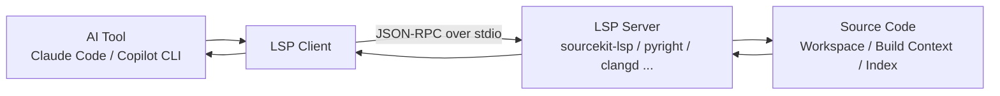

# LSP 详解 — Language Server Protocol
> 适用对象：Claude Code、GitHub Copilot CLI、终端型 AI coding tools 使用者  
> 更新日期：2026-05-11  
> 目标：理解 LSP 是什么、怎么配置、日常怎么用、出了问题如何排查
---
## 什么是 LSP
LSP 全称 **Language Server Protocol**。它最早由 **Microsoft** 为 VS Code 推动制定，现在已经是事实上的行业标准。
它要解决的核心问题是：**把“语言智能”从“编辑器”里拆出来**。过去每个 editor 都要自己实现一套 Swift、Python、TypeScript 等语言支持，包括跳转定义、查找引用、hover、重命名、诊断、补全。这样会带来三个典型问题：重复造轮子、不同工具体验不一致、新语言支持难以快速扩散。
LSP 的设计思路很简单：
- **LSP Server** 负责理解语言
- **LSP Client** 负责和 editor / AI tool 交互
- 双方通过标准协议通信
于是就实现了：**one server, many editors**。
放到 AI coding tools 的语境里，LSP 的价值更直接。Claude Code 和 GitHub Copilot CLI 虽然能理解自然语言任务，但如果想做**语义级、可验证、精确**的代码操作，仍然需要语言服务器提供底层能力。
AI 工具里最常见的 LSP 能力包括：
- `goToDefinition`
- `findReferences`
- `hover`
- `documentSymbol`
- `workspaceSymbol`
- `rename`
- `incomingCalls`
- `outgoingCalls`
- `goToImplementation`
一句话理解：
> 大模型负责理解你的意图，LSP 负责精确理解代码。
没有 LSP 时，AI 往往只能读文件、grep 关键字、猜 symbol 所在位置；有了 LSP 之后，AI 才能更稳地完成定义跳转、引用分析、类型推断和 semantic rename。
---
## 核心架构
LSP 的结构通常可以拆成 4 层：
1. **AI Tool**：Claude Code / Copilot CLI，负责接收自然语言任务
2. **LSP Client**：AI 工具内部的协议客户端，负责发请求、收响应
3. **LSP Server**：语言对应的服务进程，如 `sourcekit-lsp`、`clangd`、`pyright-langserver`
4. **Source Code / Build Context**：源码、依赖、编译配置、索引上下文
最常见的通信方式是 **JSON-RPC over stdio**。也就是 AI tool 启动一个 server 进程，然后通过标准输入输出发送 JSON-RPC 消息。

### 每一层在做什么
**AI Tool**：理解自然语言问题、决定何时调用代码智能能力、把结果整理成人类可读的解释。你问“这个函数定义在哪里？”时，工具不会只靠模型硬猜，而是更可能调用底层 LSP。
**LSP Client**：不负责理解具体语言，它的职责是按扩展名匹配 server、启动进程、发送 `initialize` / `initialized`，再把上层意图翻译成标准请求，例如 `textDocument/definition`、`textDocument/references`、`textDocument/hover`。
**LSP Server**：负责真正的语义分析，会结合当前文件、工程结构、依赖关系、编译配置和已有索引，返回语义级结果，而不是简单的文本级结果。
**Source Code / Build Context**：很多 server 的效果高度依赖完整项目上下文。例如 Swift 依赖 Xcode project / SwiftPM context，TypeScript 依赖 `tsconfig.json`，Python 依赖 interpreter / venv，C / ObjC / C++ 依赖 compile flags。
### 初始化流程
典型流程如下：
1. AI tool 打开文件
2. 依据扩展名匹配 server
3. 启动 server 进程
4. 发送 `initialize`
5. server 返回 capability
6. client 发送 `initialized`
7. 后续按需发送 `definition`、`references`、`hover`、`rename` 等请求
所以更准确的理解方式是：AI 工具不是天生“懂所有语言”，而是把每门语言的专业理解委托给了对应的 server。
---
## LSP 提供的能力
下面是 AI coding tools 里最有价值的一组 LSP 操作。
| 操作 | 说明 | 实际用途 |
|------|------|----------|
| `goToDefinition` | 找到 symbol 的定义位置 | “这个函数是哪里定义的？” |
| `findReferences` | 找到 symbol 的所有使用位置 | “谁在用这个类 / 方法 / 变量？” |
| `hover` | 获取类型信息与文档 | 不打开实现也能先看签名、类型、注释 |
| `documentSymbol` | 列出当前文件所有 symbol | 快速理解大文件结构 |
| `workspaceSymbol` | 在整个 workspace 搜索 symbol | 找类、函数、枚举、协议 |
| `rename` | 语义级重命名 | 跨文件安全改名 |
| `incomingCalls` | 找出谁调用了这个函数 | 逆向分析入口与上游依赖 |
| `outgoingCalls` | 找出这个函数又调用了谁 | 正向分析依赖和执行路径 |
| `goToImplementation` | 找接口 / 协议 / 抽象定义的实现 | 从 protocol / interface 跳到具体实现 |
这些能力比 grep 更重要，因为它们解决的是“找到真正相关的 symbol”，而不是“找到包含这个词的文本”。举个例子：
```swift
func load() {}
func load(id: String) {}
```
如果只用 grep 搜 `load`，AI 仍然要猜哪个是定义、哪个是调用、哪个是注释。LSP 则可以基于当前 symbol、类型信息和绑定关系，直接定位到真正目标。
还要记住一点：并不是所有 server 都支持所有能力。一般来说，`definition`、`references`、`hover` 支持度最高；`rename` 大多可用但质量取决于 server；`incomingCalls` / `outgoingCalls` 支持度差异较大；`goToImplementation` 通常依赖更完整的类型系统和索引。
---
## 在 Claude Code 中配置 LSP
Claude Code 可以通过独立配置文件加载 LSP server。
### 配置位置
```bash
~/.claude/lsp-config.json
```
这类配置适合做全局默认设置，所有项目都能复用。
### 基本配置格式
```json
{
  "lspServers": {
    "swift": {
      "command": "sourcekit-lsp",
      "args": [],
      "fileExtensions": {
        ".swift": "swift"
      }
    }
  }
}
```
字段含义：
- `lspServers`：所有 server 的集合
- `swift`：这个 server 的名字，可自定义
- `command`：启动命令
- `args`：启动参数；很多 server 需要 `--stdio`
- `fileExtensions`：扩展名与 language ID 的映射
### Claude Code 如何激活 server
Claude Code 处理某个文件时，通常会按下面流程工作：读取扩展名 → 在 `fileExtensions` 中匹配 → 启动对应 server → 按 language ID 把文件交给 server。比如：
```json
"fileExtensions": {
  ".swift": "swift",
  ".m": "objective-c",
  ".mm": "objective-cpp"
}
```
这表示 `.swift` 走 Swift server，`.m` 走 Objective-C，`.mm` 走 Objective-C++。
### Claude Code 示例配置
#### Swift
```json
{
  "lspServers": {
    "swift": {
      "command": "sourcekit-lsp",
      "args": [],
      "fileExtensions": {
        ".swift": "swift"
      }
    }
  }
}
```
#### Python
```json
{
  "lspServers": {
    "python": {
      "command": "pyright-langserver",
      "args": ["--stdio"],
      "fileExtensions": {
        ".py": "python"
      }
    }
  }
}
```
#### TypeScript
```json
{
  "lspServers": {
    "typescript": {
      "command": "typescript-language-server",
      "args": ["--stdio"],
      "fileExtensions": {
        ".ts": "typescript",
        ".tsx": "typescriptreact",
        ".js": "javascript",
        ".jsx": "javascriptreact"
      }
    }
  }
}
```
### Claude Code 中的实际感知
配置好之后，Claude Code 在这些场景里的表现通常会更像“真正懂工程结构”：问“这个方法定义在哪？”时更接近真实定义；问“谁在调用这个函数？”时结果更精确；做重命名时更安全；分析大项目时，对 symbol 边界更稳定。尤其是 Swift、TypeScript 这类强依赖工程上下文的语言，LSP 带来的改进通常很明显。
---
## 在 Copilot CLI 中配置 LSP
GitHub Copilot CLI 也支持独立配置 LSP server，并且官方文档明确给出了配置方式。
### 配置位置
用户级配置：
```bash
~/.copilot/lsp-config.json
```
仓库级配置：
```bash
.github/lsp.json
```
一般可以这样理解：用户级适合做全局默认配置，仓库级适合为某个项目单独覆盖或补充。
### 配置格式
Copilot CLI 的配置格式与 Claude Code 基本一致。官方文档示例是：
```json
{
  "lspServers": {
    "typescript": {
      "command": "typescript-language-server",
      "args": ["--stdio"],
      "fileExtensions": {
        ".ts": "typescript",
        ".tsx": "typescript"
      }
    }
  }
}
```
实战里通常会把 language ID 写得更细，例如：
```json
{
  "lspServers": {
    "typescript": {
      "command": "typescript-language-server",
      "args": ["--stdio"],
      "fileExtensions": {
        ".ts": "typescript",
        ".tsx": "typescriptreact",
        ".js": "javascript",
        ".jsx": "javascriptreact"
      }
    }
  }
}
```
### 启动时的表现
Copilot CLI 启动环境后，通常会把已加载内容汇总出来。你可能会在启动或环境信息中看到类似提示：
```text
Environment loaded: ... 11 LSP servers
```
也可以在交互模式中使用：
```text
/env
/lsp
```
其中 `/env` 用来查看整个环境加载结果，`/lsp` 用来查看和管理语言服务器配置。
### Copilot CLI 中的实际收益
LSP 对 Copilot CLI 的价值主要体现在：对 symbol 的理解更精确、在大型仓库里减少误命中、“找定义 / 查引用 / 看类型”比裸 grep 更稳定、在 `/review`、`/diff`、对话式分析时减少错误推断、在重命名和调用链分析中提高安全性。
### Claude Code 与 Copilot CLI 的差异
| 维度 | Claude Code | Copilot CLI |
|------|-------------|-------------|
| 用户级配置 | `~/.claude/lsp-config.json` | `~/.copilot/lsp-config.json` |
| 仓库级配置 | 常见做法以用户级为主 | 支持 `.github/lsp.json` |
| 匹配方式 | 按扩展名匹配 server | 按扩展名匹配 server |
| 启动方式 | 启动对应语言 server | 启动对应语言 server |
| 价值 | 更强代码语义理解 | 更强代码语义理解 |
可以把它们理解为：上层交互不同，但 LSP 接入思路非常接近。
---
## 完整配置示例
下面给出一个常见的 `lsp-config.json` 完整示例，覆盖 11 个 server：Swift、Objective-C、Python、TypeScript/JavaScript、YAML、Vue、CSS、HTML、JSON、Bash、Markdown。
```json
{
  "lspServers": {
    "swift": {
      "command": "sourcekit-lsp",
      "args": [],
      "fileExtensions": {
        ".swift": "swift"
      }
    },
    "objc": {
      "command": "clangd",
      "args": ["--background-index"],
      "fileExtensions": {
        ".m": "objective-c",
        ".mm": "objective-cpp",
        ".h": "objective-c",
        ".c": "c",
        ".cc": "cpp",
        ".cpp": "cpp",
        ".hpp": "cpp"
      }
    },
    "python": {
      "command": "pyright-langserver",
      "args": ["--stdio"],
      "fileExtensions": {
        ".py": "python"
      }
    },
    "typescript": {
      "command": "typescript-language-server",
      "args": ["--stdio"],
      "fileExtensions": {
        ".ts": "typescript",
        ".tsx": "typescriptreact",
        ".js": "javascript",
        ".jsx": "javascriptreact"
      }
    },
    "yaml": {
      "command": "yaml-language-server",
      "args": ["--stdio"],
      "fileExtensions": {
        ".yml": "yaml",
        ".yaml": "yaml"
      }
    },
    "vue": {
      "command": "vue-language-server",
      "args": ["--stdio"],
      "fileExtensions": {
        ".vue": "vue"
      }
    },
    "css": {
      "command": "vscode-css-language-server",
      "args": ["--stdio"],
      "fileExtensions": {
        ".css": "css",
        ".scss": "scss",
        ".less": "less"
      }
    },
    "html": {
      "command": "vscode-html-language-server",
      "args": ["--stdio"],
      "fileExtensions": {
        ".html": "html"
      }
    },
    "json": {
      "command": "vscode-json-language-server",
      "args": ["--stdio"],
      "fileExtensions": {
        ".json": "json",
        ".jsonc": "jsonc"
      }
    },
    "bash": {
      "command": "bash-language-server",
      "args": ["start"],
      "fileExtensions": {
        ".sh": "shellscript",
        ".bash": "shellscript",
        ".zsh": "shellscript"
      }
    },
    "markdown": {
      "command": "marksman",
      "args": ["server"],
      "fileExtensions": {
        ".md": "markdown"
      }
    }
  }
}
```
### 11 个 server 速查表
| Server | 典型安装命令 | 支持扩展名 | 它主要提供什么 |
|--------|--------------|------------|----------------|
| `sourcekit-lsp` | Xcode / Command Line Tools 自带，或 `xcode-select --install` | `.swift` | Swift 的定义跳转、引用、类型信息、实现查找 |
| `clangd` | `brew install llvm` 或系统自带 | `.m` `.mm` `.h` `.c` `.cpp` `.hpp` | ObjC / C / C++ 的语义分析、重命名、引用、定义 |
| `pyright-langserver` | `npm i -g pyright` | `.py` | Python 类型推断、定义、引用、诊断 |
| `typescript-language-server` | `npm i -g typescript typescript-language-server` | `.ts` `.tsx` `.js` `.jsx` | TS / JS 类型系统、定义、引用、rename、symbol 搜索 |
| `yaml-language-server` | `npm i -g yaml-language-server` | `.yml` `.yaml` | YAML schema、hover、校验、符号 |
| `vue-language-server` | `npm i -g @vue/language-server` | `.vue` | Vue SFC 的 script / template 语义理解 |
| `vscode-css-language-server` | `npm i -g vscode-langservers-extracted` | `.css` `.scss` `.less` | CSS 属性、selector、hover |
| `vscode-html-language-server` | `npm i -g vscode-langservers-extracted` | `.html` | HTML 标签、属性、结构信息 |
| `vscode-json-language-server` | `npm i -g vscode-langservers-extracted` | `.json` `.jsonc` | JSON schema、校验、路径提示 |
| `bash-language-server` | `npm i -g bash-language-server` | `.sh` `.bash` `.zsh` | Shell 变量 / 函数分析、部分跳转 |
| `marksman` | `brew install marksman` | `.md` | Markdown 标题、链接、文档结构分析 |
### 配置时的实践建议
- Swift 通常只把 `.swift` 交给 `sourcekit-lsp`
- Objective-C / C / C++ 通常交给 `clangd`
- Python 重点不只在 `.py`，还在 interpreter / venv 是否正确
- TypeScript / JavaScript 最好统一交给 `typescript-language-server`
- YAML、JSON、Bash、Markdown 这类“配置语言”也很值得配，因为大量真实问题都发生在 config、workflow、script、docs 中
---
## 日常工作中 LSP 如何体现
这一节只看真实工作流，不讲抽象概念。
### 1. 跳转定义
用户问题：
> “这个函数是哪里定义的？”
#### 没有 LSP 时
AI 通常会先 grep 函数名，再在一堆结果里猜哪个是定义，然后继续打开几个文件验证。问题是：同名函数会混、重载方法会混、字符串和注释也会混，结果取决于文本模式而不是语义关系。
#### 有 LSP 时
AI 直接调用 `goToDefinition`，返回的是当前 symbol 对应的真实定义位置。
#### 对比
| 场景 | 无 LSP | 有 LSP |
|------|--------|--------|
| `UserService.fetch()` | grep `fetch`，命中几十处 | 直接跳到当前调用绑定的定义 |
| Swift extension 方法 | 手动翻 extension 文件 | 直接回到具体 extension 实现 |
| TS interface 属性 | 文本匹配不稳定 | 精确定位到类型定义 |
### 2. 查找引用
用户问题：
> “谁在用这个类？”
#### 没有 LSP 时
AI 会 grep 类名，然后人工剔除注释、README、字符串、mock 数据。这样得到的是“名字出现位置”，不是“真正引用位置”。
#### 有 LSP 时
AI 用 `findReferences` 返回语义引用，例如真正实例化的位置、真正访问成员的位置、真正声明类型的位置，而不是文档里顺手提到一次也算引用。
### 3. 重命名
用户问题：
> “把这个变量改名。”
#### 没有 LSP 时
通常只能做字符串替换或多轮 grep + edit，风险很高：会改到注释、字符串、无关局部变量，也可能漏掉真正绑定的引用点。
#### 有 LSP 时
AI 可以调用 `rename` 做 semantic rename，只修改与当前 symbol 真实绑定的位置。把 `userId` 改为 `accountId` 时，这个差异尤其明显。
### 4. 类型推断
用户问题：
> “这个参数是什么类型？”
#### 没有 LSP 时
AI 需要往上翻函数声明、查 `typealias`、看 import、判断 generic 约束，经常要读很多源码。
#### 有 LSP 时
直接 `hover`，通常就能看到类型签名、参数类型、返回值类型和文档注释。这在 Swift 泛型、TypeScript 联合类型、Python 类型标注中尤其有用。
### 5. 符号搜索
用户问题：
> “帮我找项目里处理登录的类 / 函数。”
#### 没有 LSP 时
AI 一般先 grep `login`，再结合文件名和上下文猜哪些像业务入口。
#### 有 LSP 时
AI 可以优先调用 `workspaceSymbol` 搜索真正的符号，更容易直接找到 `LoginViewModel`、`AuthManager`、`handleLogin()`、`loginWithToken()`，而不会把普通字符串和注释也混进来。
### before / after
#### 没有 LSP
```text
用户：这个函数是谁在调？
AI：我先 grep 一下函数名，可能有这些地方……
```
特点：依赖文本搜索、要看更多文件做二次确认、噪声大、误判率高。
#### 有 LSP
```text
用户：这个函数是谁在调？
AI：我直接查 incomingCalls / findReferences，返回真实调用链。
```
特点：语义级结果、范围更小、更像“代码事实”，也更适合大仓库和重构任务。
---
## LSP vs grep/glob
它们不是互相替代，而是各有最适合的场景。
| 维度 | grep/glob | LSP |
|------|-----------|-----|
| Precision | 文本级匹配，容易误命中 | 语义级匹配，通常更准确 |
| Cross-file understanding | 靠路径和文本推断 | 原生支持跨文件 symbol 关系 |
| Rename safety | 本质不安全 | `rename` 可做 semantic rename |
| Type awareness | 没有 | 有类型信息、签名、文档、实现关系 |
| Speed on large codebases | 扫描快，但人工筛选成本高 | 首次索引可能慢，后续语义查询更省事 |
### 什么时候优先用 grep / glob
- 只知道关键词，不知道 symbol 名
- 查配置值、日志文案、埋点 key、URL 路径
- 查某类文件路径
- 先做粗筛
### 什么时候优先用 LSP
- 找定义
- 查引用
- 看类型
- 找实现类
- 做重命名
- 看调用链
### 最佳实践
最稳的策略通常是：**先用 LSP 缩到正确 symbol，再用 grep / view 看周边上下文。**
---
## 安装 LSP Server
下面是 11 个常见 server 的安装与验证命令。
| Server | 安装命令 | 验证命令 |
|--------|----------|----------|
| `sourcekit-lsp` | `xcode-select --install` 或安装 Xcode | `xcrun sourcekit-lsp --help` |
| `clangd` | `brew install llvm` | `clangd --version` |
| `pyright-langserver` | `npm i -g pyright` | `pyright-langserver --version` |
| `typescript-language-server` | `npm i -g typescript typescript-language-server` | `typescript-language-server --version` |
| `yaml-language-server` | `npm i -g yaml-language-server` | `yaml-language-server --version` |
| `vue-language-server` | `npm i -g @vue/language-server` | `vue-language-server --version` |
| `vscode-css-language-server` | `npm i -g vscode-langservers-extracted` | `vscode-css-language-server --version` |
| `vscode-html-language-server` | `npm i -g vscode-langservers-extracted` | `vscode-html-language-server --version` |
| `vscode-json-language-server` | `npm i -g vscode-langservers-extracted` | `vscode-json-language-server --version` |
| `bash-language-server` | `npm i -g bash-language-server` | `bash-language-server --version` |
| `marksman` | `brew install marksman` | `marksman --version` |
### 一次性安装前端常用 server
```bash
npm i -g \
  typescript \
  typescript-language-server \
  yaml-language-server \
  @vue/language-server \
  vscode-langservers-extracted \
  bash-language-server \
  pyright
```
### macOS / iOS 开发者的典型组合
```bash
xcode-select --install
brew install llvm marksman
npm i -g pyright bash-language-server yaml-language-server vscode-langservers-extracted
```
---
## 调试与排查
LSP 最常见的问题不是“不会写配置”，而是“写了但没生效”。下面按最实用的顺序排查。
### 1. 先确认 server 能启动
```bash
which sourcekit-lsp
which pyright-langserver
which typescript-language-server
which clangd
```
如果 `which` 都找不到，AI tool 当然也启动不了。
### 2. 再检查参数是不是正确
很多 server 必须通过 stdio 工作，所以最常见参数是：
```json
"args": ["--stdio"]
```
参数不对，client 和 server 之间就无法正常通信。
### 3. 检查扩展名映射
很多“LSP 不生效”并不是 server 挂了，而是扩展名没命中。例如你只写了：
```json
".ts": "typescript"
```
却漏掉 `.tsx`、`.js`、`.jsx`，那 React 项目里就会出现“有的文件有 LSP，有的没有”。
### 4. 检查工程上下文是否完整
即使命令和扩展名都没问题，server 表现依然可能一般，因为缺少真实项目上下文。典型情况包括：TypeScript 找不到 `tsconfig.json`、Swift 没有正确的 Xcode / SwiftPM context、Python 没有正确 interpreter / venv、`clangd` 缺少 compile flags。
### 5. 首次索引慢是正常现象
大项目、monorepo、依赖很多的 TypeScript 仓库、需要 background index 的 `clangd`、上下文复杂的 Swift 工程，首次启动都可能比较慢。这通常是“第一次慢，后面快很多”。
### 6. 某些能力缺失不一定是坏事
如果 `hover` 和 `goToDefinition` 正常，但 `incomingCalls` 没结果，很多时候不是配置错，而是对应 server 对这项 capability 支持有限。要先判断是 server 根本没起，还是起了但没实现完整能力。
### 7. 如何验证配置是否真的生效
#### Claude Code
重点看：
- 配置文件是否存在
- server 命令是否可执行
- 对代码查询是否出现明显的语义级提升
#### Copilot CLI
重点看环境加载信息：
```text
Environment loaded: ... X LSP servers
```
也可以通过：
```text
/env
/lsp
```
如果显示 server 数量为 0，说明配置根本没被加载；如果数量正常但某语言无效果，就继续查扩展名、命令路径、参数和工程上下文。
### 8. 一个扩展名不要绑多个 server
理论上可以让多个 server 同时处理一种扩展名，但实践里非常不建议。原因很简单：谁生效不容易预测、结果可能不一致、排查会很痛苦。最佳实践仍然是：**一个扩展名只绑定一个主 server。**
---
## 常见问题
### Q: LSP 和代码补全有什么关系？
有关系，但 LSP 不等于“只是补全”。补全只是其中一种能力。更大的价值在于定义跳转、引用搜索、类型信息、重命名、调用链、符号搜索和诊断。在 AI tools 里，最关键的反而不是补全，而是它让 AI 从“文本理解”升级到“语义理解”。
### Q: 为什么有些操作不可用？
常见原因有四类：server 没启动、扩展名没匹配上、项目上下文不完整、server 本身不支持该 capability。建议先查命令能否运行，再查 `fileExtensions`，最后再判断是不是 server 的能力边界。
### Q: LSP 会拖慢 AI 工具吗？
会带来启动和索引成本，但通常值得。它的代价主要是启动 server、建立索引、解析项目；收益则是减少误判、减少无效 grep、提高重命名安全性、提升大型工程分析效率。大多数时候，它不是“拖慢 AI”，而是“前期多花一点时间，后期少返工”。
### Q: 一个文件可以被多个 LSP Server 处理吗？
理论上可以配置出重叠映射，但不建议这么做。最稳的做法仍然是一个扩展名只对应一个主 server，例如 `.swift` → `sourcekit-lsp`，`.m/.mm/.h` → `clangd`，`.ts/.tsx/.js/.jsx` → `typescript-language-server`。
### Q: LSP 能完全替代 grep / glob 吗？
不能。LSP 擅长语义查询，grep / glob 擅长文本扫描和路径搜索。正确策略不是二选一，而是分工明确：语义问题优先 LSP，文本问题优先 grep / glob。
### Q: 为什么同样是 Swift，有时效果很好，有时一般？
因为 Swift 对工程上下文依赖很强。Xcode 工程是否完整、`Package.swift` 是否可解析、module import 是否正确、当前目录是不是项目根目录，都会直接影响 `sourcekit-lsp` 的效果。语言越依赖编译上下文，LSP 结果就越依赖项目本身是否完整。
---
## 实战建议
### 建议 1：把 LSP 当成“语义索引层”
不要只把它理解成 editor 的一个附属功能。在 AI coding workflow 里，更好的心智模型是：大模型理解任务，文件系统工具读写文件，Shell 执行命令，LSP 负责理解代码语义。
### 建议 2：优先覆盖主语言 + 配置语言
很多人配置 LSP 时只装主语言，其实真实工程里收益最大的组合通常是：主语言 + 配置语言。也就是 Swift / Python / TypeScript 之外，把 YAML、JSON、Bash、Markdown 也配上。
### 建议 3：不要为了“完整”而堆很多 server
LSP server 不是越多越好。优先安装自己最常用、当前仓库最常改的那些语言即可。如果某个 server 基本碰不到，就没必要为了形式上的“全覆盖”强行装上。
### 建议 4：先验证 3 个核心动作
一个 server 安装完成后，先不要追求所有高级特性，先验证这 3 个动作：
1. `goToDefinition`
2. `findReferences`
3. `hover`
只要这三项稳定，说明大部分基础语义链路已经跑通。
### 建议 5：把 rename 当成高价值能力
没有 LSP 时，很多“改名”其实只是更聪明一点的文本替换；有了 LSP，`rename` 才真正接近跨文件安全重构。这也是为什么一旦开始做中大型重构，LSP 的价值会迅速放大。
---
## 结论
如果只用一句话总结 LSP：
> 它让 AI coding tools 从“会读代码文本”，升级为“会理解代码符号关系”。
对 Claude Code 和 GitHub Copilot CLI 来说，LSP 都不是锦上添花，而是让很多高级代码操作变得可靠的基础设施。你真正能感受到的变化通常是：查定义更快、查引用更准、看类型更轻松、找实现更直接、改名更安全、大项目里少走很多弯路。
如果你已经开始把 AI 工具用于真实工程，而不是只拿来做小脚本问答，那么 LSP 基本属于必配项。最值得做的下一步不是继续停留在概念层，而是：
1. 选 2~3 门你最常用的语言
2. 装好对应 server
3. 配置 `lsp-config.json`
4. 用“跳转定义 / 查找引用 / hover”做一轮真实验证
一旦这条链路跑通，你会明显感觉到：**AI 工具开始真正“进项目状态”了。**
