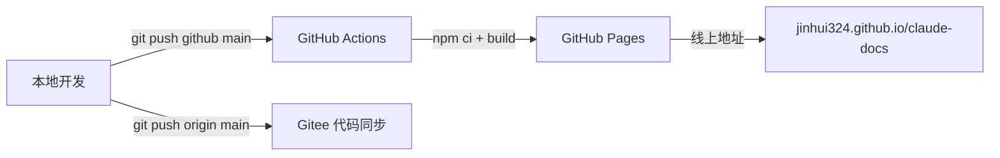

# 发布与部署

本站基于 **VitePress** 构建，使用 **GitHub Pages** 托管，推送 `main` 即自动部署。同时同步代码到 **Gitee**。

## 架构总览



## 部署方式

### GitHub Pages（自动部署）

推送到 `main` 分支即自动触发 GitHub Actions 构建并部署：

```bash
git push github main
```

- **触发条件**：`push` 到 `main` 分支，或手动 `workflow_dispatch`
- **构建流程**：`checkout` → `setup-node@20` → `npm ci` → `npm run build` → 上传产物 → 部署
- **产物路径**：`.vitepress/dist/`
- **线上地址**：[https://jinhui324.github.io/claude-docs/](https://jinhui324.github.io/claude-docs/)

### Gitee（仅代码同步）

```bash
git push origin main
```

Gitee 仅存储代码，不做页面部署。仓库地址：[https://gitee.com/jinhuizhang/claude-docs](https://gitee.com/jinhuizhang/claude-docs)

## 一键部署流程

在 AI 工具（Claude Code / Copilot CLI）中直接说 **"部署"** 即可触发以下完整流程：

1. 检测未提交改动 → 自动提交（`docs: <描述>`）
2. `git push github main` → 触发 GitHub Actions
3. `git push origin main` → 同步 Gitee

全部成功后返回线上地址。

## GitHub Actions 配置

工作流文件位于 `.github/workflows/deploy.yml`：

```yaml
name: Deploy to GitHub Pages

on:
  push:
    branches: [main]
  workflow_dispatch:

permissions:
  contents: read
  pages: write
  id-token: write

concurrency:
  group: pages
  cancel-in-progress: false

jobs:
  build:
    runs-on: ubuntu-latest
    steps:
      - uses: actions/checkout@v4
      - uses: actions/setup-node@v4
        with:
          node-version: 20
          cache: npm
      - run: npm ci
      - run: npm run build
      - uses: actions/upload-pages-artifact@v3
        with:
          path: .vitepress/dist

  deploy:
    environment:
      name: github-pages
      url: ${{ steps.deployment.outputs.page_url }}
    needs: build
    runs-on: ubuntu-latest
    steps:
      - id: deployment
        uses: actions/deploy-pages@v4
```

### 关键配置说明

| 配置项 | 说明 |
|--------|------|
| `permissions.pages: write` | 允许工作流写入 GitHub Pages |
| `permissions.id-token: write` | OIDC 令牌，部署鉴权所需 |
| `concurrency.cancel-in-progress: false` | 不取消进行中的部署，避免中断 |
| `cache: npm` | 缓存 npm 依赖，加速构建 |

## VitePress 配置要点

### Base Path

非 `username.github.io` 仓库必须设置 `base`：

```ts
// .vitepress/config.ts
export default defineConfig({
  base: '/claude-docs/',
  // ...
})
```

### 构建命令

```bash
npm run dev        # 开发服务器（localhost:5173，热更新）
npm run build      # 构建静态文件 → .vitepress/dist/
npm run preview    # 本地预览构建产物
```

## Git 远程仓库

```bash
# 查看当前 remote
git remote -v

# github → GitHub Pages 部署源
# origin → Gitee 代码同步
```

| Remote | 地址 | 用途 |
|--------|------|------|
| `github` | `https://github.com/Jinhui324/claude-docs.git` | 部署（推送触发 Actions） |
| `origin` | `https://gitee.com/jinhuizhang/claude-docs.git` | 代码同步 |

## 新增文章后发布

1. 在对应目录创建 `.md` 文件
2. 在 `.vitepress/config.ts` 的 `nav` / `sidebar` 中添加条目
3. 本地验证：`npm run build`
4. 部署：

```bash
git add -A
git commit -m "docs: 新增 xxx 文档"
git push github main    # 部署
git push origin main    # 同步
```

## 故障排查

| 问题 | 排查方式 |
|------|----------|
| Pages 未更新 | 检查 GitHub Actions 运行状态：仓库 → Actions 标签页 |
| 构建失败 | 本地 `npm run build` 验证是否有报错 |
| 404 页面 | 检查 `config.ts` 中 `base` 是否正确设置为 `/claude-docs/` |
| 样式/链接异常 | 确认所有内部链接使用相对路径，不带 `base` 前缀 |
