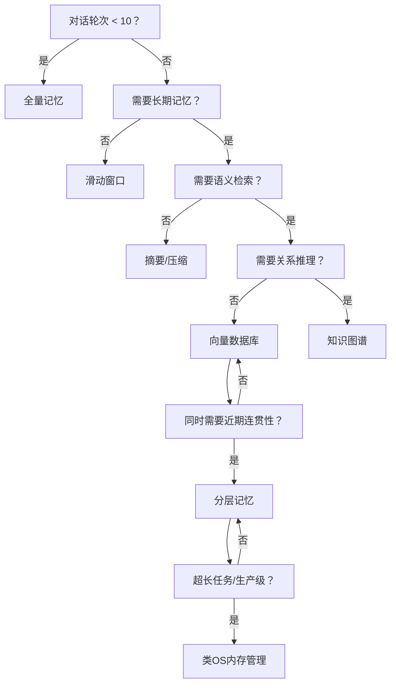

# AI 智能体 8 种记忆策略对比全解

> 原文来源：微信公众号「AI大模型老仔」

AI 智能体（Agent）的记忆能力，决定了它能否跨轮次保持上下文、处理长任务、积累经验。本文系统梳理 8 种主流 Memory 策略，分析各自适用场景与取舍。


---

## 策略总览

| # | 策略 | 核心思路 | 适用场景 |
|---|------|---------|---------|
| 01 | 全量记忆 | 不丢弃任何内容 | 短对话、调试阶段 |
| 02 | 滑动窗口 | 保留最近 N 条 | 通用聊天场景 |
| 03 | 相关性过滤 | 按重要性评分保留 | 信息量大但重点分散 |
| 04 | 摘要/压缩 | 提炼关键信息 | 长任务、多轮规划 |
| 05 | 向量数据库 | 语义检索外部记忆 | 知识库问答、个性化助手 |
| 06 | 知识图谱 | 结构化实体关系存储 | 多跳推理、复杂关系查询 |
| 07 | 分层记忆 | 短期 + 长期混合 | 兼顾响应速度和历史深度 |
| 08 | 类 OS 内存管理 | 冷热数据分层 Swap | 超长上下文、生产级 Agent |

---

## 01 全量记忆：不遗忘任何内容


### 工作原理

每一轮对话的完整内容都被保留，并在每次调用 LLM 时将所有历史记录一并作为上下文传入。

```
用户输入 → [历史全量 + 新输入] → LLM → 输出
```

### 优点

- 实现极其简单，无需任何过滤或压缩逻辑
- 信息完全保留，不存在上下文丢失问题
- 适合快速原型验证

### 缺点

- 随对话轮次增加，context 长度线性增长，极易超出模型窗口上限
- Token 消耗高，响应延迟增大，成本随之上升
- 不适合长期任务或高频对话

### 适用场景

短对话（< 10 轮）、开发调试阶段、需要完整追溯的审计场景。

---

## 02 滑动窗口：固定长度记忆


### 工作原理

维护一个固定大小的队列（如最近 10 条），新消息进入时旧消息被自动淘汰，始终只传最近 N 条给 LLM。

```
[...旧消息被丢弃] ← [窗口: 最近 N 条] ← 新消息不断进入
```

### 优点

- 实现简单，内存和 Token 开销固定可控
- 响应速度稳定，不随时间增长而降级
- 适合大多数通用聊天场景

### 缺点

- 健忘性强，超出窗口的历史信息永久丢失
- 无法支持跨轮次的长期记忆（如用户偏好、历史决策）
- 窗口大小难以权衡：太小则健忘，太大则成本高

### 适用场景

通用对话助手、客服机器人、无需长期记忆的任务执行。

---

## 03 相关性过滤：智能遗忘次要信息


### 工作原理

对每条历史消息进行重要性评分（基于关键词、语义相似度、时间衰减等），只保留高分内容传给 LLM。

```
历史消息 → 评分模型 → 筛选高重要性内容 → 传入 LLM
```

### 优点

- 关键信息不会因为时间先后而被丢弃
- 比盲目截断更智能，能在有限窗口内保留最有价值的内容
- 可定制评分维度（时效性、相关度、用户标注等）

### 缺点

- "重要性"的定义和评估是核心难点，容易出现误删
- 评分逻辑增加了系统复杂度和延迟
- 对新场景泛化能力有限，需要持续调优

### 适用场景

信息密度高的长对话、需要自动管理上下文的任务型 Agent。

---

## 04 摘要/压缩：提炼关键信息


### 工作原理

当上下文超过一定长度时，调用 LLM 将历史对话压缩为结构化摘要（包含事实、用户偏好、决策记录等），替换原始历史。

```
历史全量 → LLM 摘要 → 压缩后的 Summary → 替代原始历史传入
```

### 优点

- 大幅节省上下文 Token，支持理论上无限的长期记忆
- 摘要可结构化，便于后续检索和引用
- 能跨越非常长的任务跨度保留关键信息

### 缺点

- 摘要质量完全依赖 LLM 能力，可能引入偏差或遗漏细节
- 每次压缩需要额外的 LLM 调用，增加延迟和成本
- 压缩是单向操作，原始细节不可恢复

### 适用场景

多轮规划任务、长期项目助手、需要跨 session 保留上下文的场景。

---

## 05 向量数据库：语义检索外部记忆


### 工作原理

将历史对话/知识进行 Embedding，存入向量数据库。每次查询时根据当前输入的语义相似度检索最相关的历史片段。

```
历史对话 → Embedding → VectorDB 存储
当前输入 → Embedding → 语义相似度检索 → 注入 LLM 上下文
```

### 优点

- 支持无限量的外部长期记忆，不受 context 窗口限制
- 语义级检索，能找到字面不同但语义相关的内容
- 可跨多个 session 持久化，是真正意义上的长期记忆

### 缺点

- 依赖 Embedding 模型质量，低质量 Embedding 导致召回不准
- 需要额外部署和维护向量数据库（Pinecone、Weaviate、Chroma 等）
- 检索结果缺乏时序关系，可能丢失上下文逻辑连贯性

### 适用场景

个性化助手、企业知识库问答、需要跨 session 记忆用户历史的场景。

---

## 06 知识图谱：结构化关系记忆


### 工作原理

将对话中提取的实体、属性、关系存入知识图谱，支持多跳推理和精确查询。

```
对话 → 实体/关系抽取 → 知识图谱更新
查询 → 图遍历/推理 → 精确返回关联结果
```

**示例图谱结构：**
```
用户 ──[偏好]──→ Python
用户 ──[在做]──→ 项目A
项目A ──[使用]──→ FastAPI
项目A ──[依赖]──→ PostgreSQL
```

### 优点

- 结构化存储，查询精度高，可解释性强
- 支持多跳推理（"用户的项目依赖哪些数据库？"）
- 关系路径可追溯，比向量检索更精确

### 缺点

- 图谱构建和维护成本高，需要实体/关系抽取模块
- 对模糊语义查询支持有限，通常需配合向量搜索使用
- 图谱更新需要处理冲突和版本一致性

### 适用场景

复杂关系查询（如代码依赖分析）、需要多跳推理的任务、企业知识图谱构建。

---

## 07 分层记忆：短期与长期结合


### 工作原理

类人脑的两级记忆结构：
- **短期记忆**（Working Memory）：当前 context 窗口，保存最近几轮对话
- **长期记忆**（Long-term Memory）：向量数据库，存储历史重要信息

```
当前对话 ──[近期上下文]──→ 短期记忆（context window）
重要信息 ──[异步写入]──→  长期记忆（VectorDB）
检索需求 ──[语义召回]──→  从长期记忆注入当前上下文
```

### 优点

- 兼顾近期响应的连贯性和历史知识的深度
- 架构层次清晰，可独立优化每一层
- 接近人类认知模型，泛化性好

### 缺点

- 实现复杂，需要协调两个存储系统的读写时机
- 短期→长期的迁移策略（何时写入、写入什么）难以设计
- 多模块协同调优成本高

### 适用场景

长期陪伴型助手、需要同时处理短期任务和历史积累的复杂 Agent。

---

## 08 类 OS 内存管理：冷热数据 Swap


### 工作原理

将 LLM 的 context 窗口类比为 RAM，超出容量的内容 Page Out 到外部存储，需要时 Page In 回来。

```
活跃内容（热数据）  ── 在 context window（RAM）中
非活跃内容（冷数据）── Page Out → 外部存储（磁盘/数据库）
需要时              ── Page In  → 重新载入 context window
```

**与传统 OS 内存管理对比：**

| OS 概念 | Agent 记忆映射 |
|--------|---------------|
| RAM | Context Window |
| 磁盘/Swap | 外部存储（DB/文件） |
| Page In | 检索召回注入 |
| Page Out | 内容序列化存储 |
| LRU 策略 | 基于时间/重要性淘汰 |

### 优点

- 架构原则借鉴成熟的 OS 设计，结构清晰
- 热/冷数据分层，资源利用率高
- 可无限扩展外部存储，理论上不受记忆容量限制

### 缺点

- Page In/Out 触发机制设计复杂
- 冷数据拼接回 context 后需处理连贯性和顺序问题
- 召回不及时会影响对话的流畅性

### 适用场景

超长任务（> 100 轮）、生产级 Agent 系统、需要精细内存管理的高并发场景。

---

## 选型建议



> 实际系统往往是多策略组合：**滑动窗口（短期）+ 向量数据库（长期）+ 摘要压缩（归档）** 是目前最常见的生产架构。
