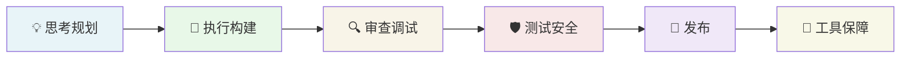

# Skill 全景手册

Claude Code 的 Skill（技能）是以 Markdown 文件定义的**可复用工作流程**，每个 skill 对应一个专业角色或开发阶段，通过 `/skill名` 斜杠命令触发。本手册整合了两个来源：

| 来源 | 标记 | 说明 |
|------|------|------|
| 本地私有 skill | `本地` | 存放于 `~/my-skills/`，已同步到 `~/.claude/skills/` |
| gstack（Garry Tan） | `gstack` | 需独立安装，依赖二进制工具，见 [gstack 安装说明](https://github.com/garrytan/gstack) |

---

## 开发流水线总览

所有 skill 按开发流水线组织。每个阶段的 skill 首尾相接，前一步的输出即为下一步的输入。

```
思考/规划 → 执行/构建 → 审查/调试 → 测试/安全 → 发布 → 工具保障
```



---

## 阶段一：思考与规划

在写任何一行代码之前，先想清楚——这是整个 skill 体系最核心的理念。

### `/brainstorming` <Badge type="tip" text="本地" />

**触发方式：** 讨论功能、想做新特性、「我想加一个...」、「帮我设计一个...」

**能力：**
- 通过对话逐步挖掘需求，不是一次性询问所有问题
- 澄清目标用户、使用场景、边界条件
- 输出结构化设计文档供后续 `/writing-plans` 使用

**作用：** 防止「理解偏差型返工」。AI 很擅长执行，但如果执行方向错了，写了再多代码也白搭。

**示例：**
```
你：我想给 Lock 插件加一个固件强制升级的功能

/brainstorming
→ 询问：哪些型号需要？用户拒绝升级怎么处理？是 OTA 还是蓝牙？
→ 最终输出设计文档，覆盖你最初没想到的边界情况
```

---

### `/writing-plans` <Badge type="tip" text="本地" />

**触发方式：** 有需求文档或设计稿、多步骤功能开发前

**能力：**
- 将需求拆解为细粒度、有顺序的任务列表
- 每个任务指定涉及文件、测试方式、注意事项
- 产出计划文档给 `/executing-plans` 消费

**作用：** 把「模糊的想法」转化为「可被 AI 安全执行的工单」，避免 AI 在执行时自作主张。

**示例：**
```
你：我有一个 Jira ticket，需要实现蓝牙重连逻辑

/writing-plans
→ 拆解为 6 个任务：协议解析 → 状态机 → 重连策略 → 超时处理 → 单测 → 接口更新
→ 每个任务标注涉及文件路径和验证方法
```

---

### `/office-hours` <Badge type="warning" text="gstack" />

**触发方式：** 开始任何新功能前、产品方向模糊时

**能力：**
- 用 YC 路演式的 6 个强迫性问题质疑你的假设
- 不接受「功能描述」，追问「用户真正的痛点是什么」
- 挑战前提、提出 3 种实现路径及工作量对比
- 输出设计文档，被所有下游 plan 类 skill 自动读取

**作用：** 类似 YC 合伙人 office hours——防止你花三个月做了用户不需要的东西。

**示例：**
```
你：我想做一个每日简报 App，整合多个日历

/office-hours
Claude：我要质疑你的框架。你说「简报 App」，但你描述的痛点是——
        日历事件信息过时、准备会议要半小时、AI 摘要不够准确。
        你实际上在描述的是一个个人 AI 首席助理，不是简报工具。
        [给出 3 种实现方案：最窄切入点（3天）/ 核心功能集（3周）/ 完整愿景（3个月）]
        建议：先做最窄切入点，从真实使用中学习。
```

---

### `/plan-ceo-review` <Badge type="warning" text="gstack" />

**触发方式：** 计划写好后，开始执行前

**能力：**
- 以 CEO 视角审查计划，4 种模式：扩展/选择性扩展/保持范围/缩减
- 寻找计划中「真正的 10 分产品」vs「当前设计的 6 分方案」
- 挑战范围蔓延，或反过来指出遗漏的关键功能

**示例场景：** 你写了一个蓝牙重连计划，CEO review 发现你忽略了「静默重连 vs 用户感知重连」的产品决策，这个决策会影响整个状态机设计。

---

### `/plan-eng-review` <Badge type="warning" text="gstack" />

**触发方式：** CEO review 通过后

**能力：**
- 用 ASCII 图绘制数据流、状态机、错误路径
- 强制暴露隐藏假设（「你假设蓝牙连接一定是同步的？」）
- 生成测试矩阵、失败模式分析、安全关注点
- 输出测试计划供 `/qa` 读取

---

### `/autoplan` <Badge type="warning" text="gstack" />

**触发方式：** 有明确需求，想跳过手动规划

**能力：**
- 自动依次运行 office-hours → plan-ceo-review → plan-eng-review
- 全自动生成完整计划，无需逐步触发

---

## 阶段二：执行与构建

计划确认后，进入构建阶段。核心原则是**隔离执行**——用 worktree 隔离环境，用 subagent 隔离上下文。

### `/using-git-worktrees` <Badge type="tip" text="本地" />

**触发方式：** 开始任何功能开发前、需要在多个分支同时工作时

**能力：**
- 基于当前 repo 创建独立 worktree（共享 git 历史，不影响主工作区）
- 自动选择合适的目录、校验安全性
- 支持多个 worktree 并行开发不同功能

**作用：** 开发新功能时不污染主分支工作区；多个 AI agent 可以同时在不同 worktree 工作，互不干扰。

**示例：**
```
你：开始开发蓝牙重连功能

/using-git-worktrees
→ 创建 ../my-plugin-ios-feat-ble-reconnect/
→ 基于 main 分支，checkout 到 feat/ble-reconnect
→ 主工作区继续保留你当前的开发状态
```

---

### `/executing-plans` <Badge type="tip" text="本地" />

**触发方式：** 计划文档已就绪，准备开始实现

**能力：**
- 加载计划文件，批判性审查（有疑问先提问，不直接开干）
- 逐任务执行，每步骤严格按计划来，不自作主张
- 每个任务完成后自动调用 `/checkpoint save` 保存进度
- 全部完成后进入 `/finishing-a-development-branch`

**作用：** 确保 AI 按你的计划执行，不跑偏；每步有检查点，中断后可恢复。

**示例：**
```
你：按照 plan-ble-reconnect.md 执行

/executing-plans
→ 读取计划，发现「重连间隔算法」描述不清，先提问
→ 确认后开始逐任务执行，每完成一个 → checkpoint save
→ 所有任务完成 → finishing-a-development-branch
```

---

### `/subagent-driven-development` <Badge type="tip" text="本地" />

**触发方式：** 计划中有多个可并行的独立任务

**能力：**
- 为每个任务启动独立的 subagent，各自持有干净的上下文
- 每个 subagent 完成后进行两阶段 review：先检查是否符合 spec，再检查代码质量
- 主 agent 负责协调，不被子任务的细节污染上下文

**与 executing-plans 的区别：** executing-plans 是串行执行（适合强依赖任务），subagent-driven-development 是并行执行（适合独立任务）。

**示例：**
```
计划中有 4 个独立任务：UI 组件 / API 封装 / 单测 / 文档

/subagent-driven-development
→ 同时启动 4 个 subagent，各自专注于自己的任务
→ 4 个任务同时推进，而不是逐个等待
→ 每完成一个，双重 review 确认质量
```

---

### `/dispatching-parallel-agents` <Badge type="tip" text="本地" />

**触发方式：** 有 2 个以上互不依赖的任务需要处理

**能力：**
- 将任务精确分解，为每个 agent 构造专门的上下文（不继承当前 session 历史）
- agent 完成后汇报结果，主 agent 整合
- 保护主 agent 的上下文不被子任务细节污染

**作用：** 当你需要同时做「调研竞品方案」和「实现当前功能」时，让两件事并行推进，总时间减半。

---

### `/test-driven-development` <Badge type="tip" text="本地" />

**触发方式：** 实现任何功能或修复 bug 之前

**能力：**
- 先写测试，看到红色失败
- 写最少的代码让测试通过
- 重构，保持测试绿色
- 严格 Red → Green → Refactor 循环

**作用：** 防止「AI 写代码像凑数」——有测试约束，AI 无法生成看起来工作但实际上不正确的代码。

**示例：**
```
你：修复蓝牙断连后不重连的 bug

/test-driven-development
→ 先写 test_bleReconnect_afterDisconnect_triggersReconnect()
→ 运行，确认 FAIL
→ 最小化修改代码让测试 PASS
→ 重构，测试依然绿色
```

---

## 阶段三：审查与调试

代码写完不等于完成——这个阶段的 skill 是你的「质量门禁」。

### `/requesting-code-review` <Badge type="tip" text="本地" />

**触发方式：** 功能实现完成后、合并之前

**能力：**
- 启动独立 code-reviewer subagent，持有干净上下文（不继承你的开发历史）
- reviewer 只看代码产出，不看你的思考过程，给出更客观的评价
- 检查逻辑正确性、潜在 bug、规范合规、边界条件

**关键原则：** reviewer 的上下文是精心构造的，不是你 session 的副本——这是为了避免「同情性忽视」（AI 知道你为什么这样写，所以替你合理化了 bug）。

---

### `/receiving-code-review` <Badge type="tip" text="本地" />

**触发方式：** 收到来自人类或 AI 的 code review 反馈

**能力：**
- 不是「盲目接受」——先技术性评估 reviewer 的建议是否正确
- 对于可疑建议，先验证再实施
- 区分「明确改进」vs「品味差异」vs「可能有误的建议」

**作用：** 防止 AI 为了「配合 reviewer」把正确的代码改错。

**示例场景：** reviewer 说「这里应该用 async/await」，但你的代码已经是 async 结构只是形式不同——receiving-code-review 会先验证这个建议是否实际有必要，而不是直接修改。

---

### `/systematic-debugging` <Badge type="tip" text="本地" />

**触发方式：** 遇到 bug、测试失败、意外行为

**能力：**
- 铁律：**先调查，再修复**，禁止随机尝试
- 追踪数据流，定位根因
- 最多尝试 3 次修复方向，失败后停止并请求人工介入
- 记录所有失败方案（防止循环重试）

**作用：** 防止 AI 进入「随机修改代码直到测试通过」的危险模式。

**示例：**
```
蓝牙连接偶发失败

/systematic-debugging
→ 不是随机改代码，而是：追踪 MQTT 连接状态 → 检查 delegate 回调时序 → 复现步骤
→ 根因：delegate 在子线程回调，UI 更新没有切回主线程
→ 精准修复一处，验证通过
```

---

### `/investigate` <Badge type="warning" text="gstack" />

**触发方式：** 复杂 bug、生产事故根因分析

**能力：**
- 与 systematic-debugging 类似，但更侧重「根因分析」而非「修复执行」
- 会自动激活 `/freeze` 锁定调查范围，防止意外修改
- 输出详细的根因报告，可供多人协作时共享

---

### `/review` <Badge type="warning" text="gstack" />

**触发方式：** 任何 branch 有改动时，push 之前

**能力：**
- Staff Engineer 视角：找的是「能通过 CI 但会在生产炸掉」的 bug
- 自动修复明显问题，标记需要确认的问题（不自作主张）
- 智能路由：基础设施改动不需要 design review，纯后端改动不需要 UI review

---

## 阶段四：测试与安全

### `/verification-before-completion` <Badge type="tip" text="本地" />

**触发方式：** 准备声称「已完成」、提交 commit、创建 PR 之前

**能力：**
- **强制**运行验证命令，确认实际输出
- 禁止「我相信它能工作」式的断言，必须有运行证据
- 检查清单：编译通过 / 测试绿色 / lint 零 warning / 边界情况验证

**核心理念：** 「断言工作正常」和「证明工作正常」是两回事。

**示例：**
```
你：实现完了，准备 commit

/verification-before-completion
→ 运行 swiftlint lint → 发现 2 个 warning → 必须修复
→ 运行单测 → 1 个测试 FAIL → 必须修复
→ 全部通过后才允许 commit
```

---

### `/security-sweep` <Badge type="tip" text="本地" />

**触发方式：** 安全审计、发版前、新功能涉及认证/数据存储时

**能力：**
- 扫描范围可选：all / secrets / injection / auth / config / deps / ai / mobile / data
- 检测：硬编码密钥、SQL/命令注入、认证绕过、不安全配置、依赖漏洞
- 支持指定路径扫描，避免全量扫描的噪声

**示例：**
```
你：发版前做安全扫描

/security-sweep secrets auth
→ 发现 1 处硬编码 API key（在测试文件里被遗忘）
→ 发现 1 处 URL Scheme 处理没有校验 host
→ 给出具体修复方案
```

---

### `/cso` <Badge type="warning" text="gstack" />

**触发方式：** 正式安全审计、涉及用户数据的功能

**能力：**
- OWASP Top 10 + STRIDE 威胁模型双重覆盖
- 17 个误报排除规则，置信度 8/10 以上才报告
- 每个发现附带**具体攻击场景**（不是泛泛的「可能有注入风险」）
- 独立验证每个发现，不是静态分析误报

---

### `/qa` <Badge type="warning" text="gstack" />

**触发方式：** staging 环境就绪后，发布前

**能力：**
- 控制**真实浏览器**点击 UI、填表单、触发交互
- 发现 bug → 自动生成 atomic commit 修复 → 重新验证
- 每个 bug 修复自动生成回归测试
- 基于 `/plan-eng-review` 的测试矩阵决定测试路径

**作用：** AI 真的能「看到」并操作你的 App，不是停留在代码层面的猜测。

---

## 阶段五：发布

### `/finishing-a-development-branch` <Badge type="tip" text="本地" />

**触发方式：** 所有任务完成、测试通过、准备收尾

**能力：**
- 呈现结构化选项：直接 merge / 创建 PR / 清理后 merge
- 处理 squash WIP commit（配合 checkpoint 的 WIP commit 清理）
- 确认 lint / 测试 / 文档都就绪

**作用：** 防止「实现完了随意 push」——确保每个分支都以专业的状态结束。

---

### `/document-release` <Badge type="tip" text="本地" />

**触发方式：** 准备发版、需要写 Release Notes

**能力：**
- 分析两个 tag 之间的 git log，自动分类 commit（feat / fix / perf / refactor / breaking）
- 生成结构化 Release Notes，包含 Breaking Changes + 迁移指引
- 输出选项：写入 `CHANGELOG.md` / 同步到 Confluence / 直接打印

**示例输出：**
```markdown
# Release Notes — v2.3.0
> 发布日期：2026-05-06 | 对比：v2.2.0...v2.3.0

## ⚠️ Breaking Changes
- WZBLEManager.connect() 参数变更，timeout 从秒改为毫秒

## ✨ New Features
- 蓝牙自动重连，最多重试 3 次（commit: a1b2c3d）

## 🐛 Bug Fixes
- 修复断连后 delegate 不回调的问题（commit: d4e5f6g）
```

---

### `/ship` <Badge type="warning" text="gstack" />

**触发方式：** 准备 push 并创建 PR

**能力：**
- sync main → 运行测试 → 审计覆盖率 → push → 开 PR
- 如果项目没有测试框架，自动搭建一个
- 自动调用 `/document-release` 更新文档
- 每次 ship 产出测试覆盖率报告

---

### `/land-and-deploy` <Badge type="warning" text="gstack" />

**触发方式：** PR 已 approved，准备合并上线

**能力：**
- 合并 PR → 等待 CI → 等待 deploy → 验证生产健康状态
- 一条命令完成从「已批准」到「已上线验证」

---

### `/canary` <Badge type="warning" text="gstack" />

**触发方式：** 部署后监控阶段

**能力：**
- 持续监控循环：控制台错误 / 性能回归 / 页面失败
- 与部署前基准对比，发现回归立即告警

---

## 工具与保障

这些 skill 不属于某个单一阶段，而是贯穿整个开发流程的保障工具。

### `/guard` <Badge type="tip" text="本地" />

**触发方式：** 调试生产代码、IoT SDK、Lock 插件时；`guard`、`安全模式`、`锁定目录`、`freeze`

**能力（双层保护）：**

| 层级 | 功能 | 说明 |
|------|------|------|
| 命令警告 | 破坏性命令执行前强制确认 | `rm -rf`、`git reset --hard`、`force-push`、`DROP TABLE` 等 |
| 编辑边界 | 文件修改限制在指定目录内 | 边界外的 Edit/Write 操作被拒绝 |

**安全豁免（无需确认）：** `rm -rf node_modules`、`rm -rf DerivedData`、`rm -rf .build`

**示例：**
```
你：调试 WZBLEManager，只允许改 Sources/WZBluetooth/

/guard Sources/WZBluetooth/
→ Guard 已激活
→ 后续如果 AI 试图编辑 Sources/WZLock/ 里的文件 → 被拒绝
→ 尝试执行 git reset --hard → 必须先确认
```

---

### `/checkpoint` <Badge type="tip" text="本地" />

**触发方式：** `保存进度`、`checkpoint`、`save progress`、`resume`、`恢复上下文`、`继续上次`

**两个操作：**

**Save（保存）：**
- 将当前工作状态打包为 WIP commit：已完成任务、剩余任务、关键决策、踩过的坑
- 即使 session 中断，下次也能恢复完整上下文
- 格式：`WIP: <进度描述>` + `[checkpoint-context]` body

**Resume（恢复）：**
- 在新 session 中运行 `/checkpoint resume`
- 自动找到最近的 WIP commit，提取上下文
- 输出「已完成 / 待处理 / 关键决策 / 失败方案（勿重复）」摘要

**与 executing-plans 的集成：** executing-plans 在每个任务完成后自动调用 checkpoint save，实现细粒度进度持久化。

**发 PR 前清理 WIP commit：** 在 `finishing-a-development-branch` 时 squash 所有 WIP commit，保持提交历史整洁。

---

### `/writing-skills` <Badge type="tip" text="本地" />

**触发方式：** 创建新 skill、修改现有 skill、验证 skill 是否生效

**能力：**
- Skill 即 TDD：先写触发条件和期望行为，再写实现
- 验证步骤：写完 → 触发测试 → 确认行为符合预期
- 遵循团队 skill 规范：frontmatter / 结构 / 与其他 skill 的集成声明

---

### `/using-superpowers` <Badge type="tip" text="本地" />

**触发方式：** 任何新 session 开始时自动加载

**能力：**
- 建立 skill 体系的加载机制
- 要求在任何回复（包括澄清问题）之前先调用 Skill tool
- 如果作为 subagent 运行，自动跳过此 skill

---

### `/retro` <Badge type="warning" text="gstack" />

**触发方式：** 每周或每个 sprint 结束后

**能力：**
- 每周工程复盘：什么顺利了？什么卡住了？下次怎么改？
- 分析 git log、PR 历史、调试记录
- 输出行动项

---

### `/benchmark` <Badge type="warning" text="gstack" />

**触发方式：** 性能敏感改动的 before/after 对比

**能力：**
- 建立页面加载时间、Core Web Vitals、资源大小的基准
- 每个 PR 与基准对比，防止性能回归

---

## 完整 Skill 速查表

### 本地私有 Skill

| Skill | 触发时机 | 一句话描述 |
|-------|---------|-----------|
| `/brainstorming` | 任何新功能构思前 | 对话式需求挖掘，产出设计文档 |
| `/writing-plans` | 有需求，准备动手前 | 将需求拆解为可执行任务列表 |
| `/using-git-worktrees` | 开始功能开发前 | 创建隔离工作区，不污染主分支 |
| `/executing-plans` | 计划就绪，开始执行 | 按计划逐步执行，每步 checkpoint |
| `/subagent-driven-development` | 有多个并行独立任务 | 并行 subagent 执行，双重 review |
| `/dispatching-parallel-agents` | 2+ 互不依赖任务 | 精准分发，保护主 agent 上下文 |
| `/test-driven-development` | 实现功能/修复 bug 前 | Red → Green → Refactor 循环 |
| `/requesting-code-review` | 实现完成，合并前 | 启动独立 reviewer subagent |
| `/receiving-code-review` | 收到 review 反馈 | 技术评估建议，而非盲目接受 |
| `/systematic-debugging` | 遇到 bug/异常行为 | 先调查根因，再精准修复 |
| `/verification-before-completion` | 准备声称完成前 | 强制运行验证，证据先于断言 |
| `/security-sweep` | 安全审计/发版前 | 扫描密钥/注入/认证/依赖漏洞 |
| `/finishing-a-development-branch` | 所有任务完成后 | 结构化收尾：merge/PR/清理 |
| `/document-release` | 准备发版 | 自动生成结构化 Release Notes |
| `/guard` | 调试敏感模块时 | 命令警告 + 编辑目录锁定 |
| `/checkpoint` | 随时保存/恢复进度 | WIP commit 跨 session 持久化 |
| `/writing-skills` | 创建/修改 skill | TDD 式 skill 开发流程 |
| `/using-superpowers` | Session 开始 | 加载 skill 体系入口 |

### gstack Skill

| Skill | 专家角色 | 一句话描述 |
|-------|---------|-----------|
| `/office-hours` | YC 合伙人 | 6 个强迫性问题质疑你的产品假设 |
| `/plan-ceo-review` | CEO | 找到计划里「真正的 10 分产品」 |
| `/plan-eng-review` | 工程经理 | 数据流图 + 测试矩阵 + 失败模式 |
| `/plan-design-review` | 设计师 | 0-10 评分，逐维度提升到 10 分 |
| `/plan-devex-review` | DX 负责人 | 开发者体验审查，TTHW 对标竞品 |
| `/autoplan` | — | 自动运行全套 plan 流程 |
| `/review` | Staff Engineer | 找能通过 CI 但生产会炸的 bug |
| `/investigate` | 调试专家 | 根因分析，自动冻结调查范围 |
| `/design-review` | 会写代码的设计师 | 审查+修复设计问题，原子 commit |
| `/design-consultation` | 设计合伙人 | 从零构建完整设计体系 |
| `/design-shotgun` | 设计探索者 | 生成 4-6 个方案变体，迭代筛选 |
| `/design-html` | 设计工程师 | 设计稿转生产级 HTML，动态布局 |
| `/qa` | QA 负责人 | 真实浏览器测试，自动修复+回归测试 |
| `/qa-only` | QA 报告员 | 只报告不修复的纯 bug 报告 |
| `/cso` | 首席安全官 | OWASP+STRIDE，附具体攻击场景 |
| `/ship` | 发布工程师 | sync→测试→push→PR，自动更新文档 |
| `/land-and-deploy` | 发布工程师 | 合并→CI→部署→生产验证 |
| `/canary` | SRE | 部署后持续监控循环 |
| `/benchmark` | 性能工程师 | 建立性能基准，PR 级回归检测 |
| `/retro` | 工程复盘 | 每周 sprint 回顾与行动项 |
| `/codex` | OpenAI 第二意见 | 用 Codex CLI 做独立交叉 review |

---

## 典型工作流示例

### 场景 A：从零开发一个新功能

```
1. /office-hours          → 质疑需求，确认方向
2. /brainstorming         → 对话式细化设计
3. /writing-plans         → 拆解为可执行任务
4. /using-git-worktrees   → 创建隔离工作区
5. /executing-plans       → 逐步执行（每步自动 checkpoint）
   ├── /test-driven-development  → 每个功能先写测试
   └── /verification-before-completion → 完成前验证
6. /requesting-code-review → 独立 reviewer 检查
7. /security-sweep        → 安全扫描
8. /finishing-a-development-branch → 创建 PR
9. /document-release      → 更新 Release Notes
```

### 场景 B：修复生产 Bug

```
1. /guard Sources/受影响模块/  → 锁定范围，防止误改
2. /systematic-debugging       → 追踪根因
3. /test-driven-development     → 先写回归测试
4. /verification-before-completion → 验证修复
5. /checkpoint save             → 保存调试过程
6. /requesting-code-review      → 修复前 review
```

### 场景 C：中断后继续工作

```
新 Session：
/checkpoint resume
→ 恢复：已完成 3/6 个任务 / 剩余 3 个 / 上次卡在「状态机设计」
→ 从「待处理第一项」继续
```

---

::: tip 安装说明
- **本地 skill**：已预装在 `~/.claude/skills/`，直接使用
- **gstack**：需单独安装，参考 [garrytan/gstack](https://github.com/garrytan/gstack)
  ```bash
  git clone --depth 1 https://github.com/garrytan/gstack.git ~/.claude/skills/gstack
  cd ~/.claude/skills/gstack && ./setup
  ```
:::

---

> **参考来源：** [gstack · Garry Tan's Claude Code skill pack](https://github.com/garrytan/gstack)
